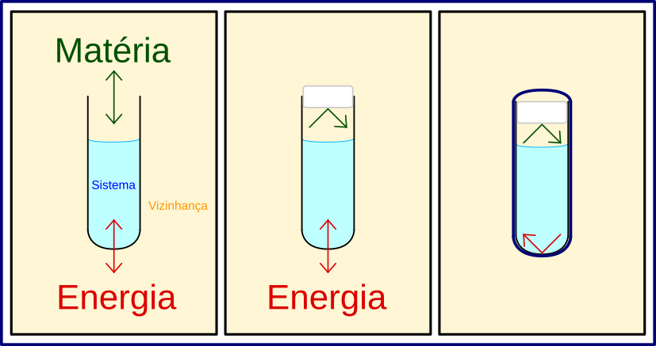
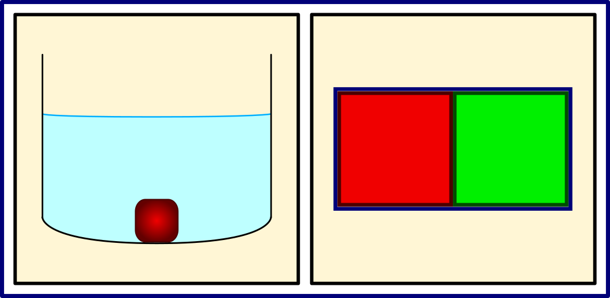

## Definições

  A <b>Termodinâmica</b> é o estudo do fluxo de <b>energia</b> entre corpos. A Termodinâmica Clássica (TC) apoia-se em quatro leis fundamentais, que foram desenvolvidas a partir do século XIX pelos trabalhos de diversos cientistas notáveis - Clausius, Thomson, Carnot, Planck, Nernst, Boltzmann, Gibbs e Helmholtz, entre outros. Para entender quais são as regras que determinam como a energia é transferida entre corpos, precisamos, primeiramente, definir o que é um sistema termodinâmico, o que é energia e como ela pode ser adicionada ou removida de sistemas.

### Sistemas e subsistemas

  Um <b>sistema</b> é uma região do universo na qual estamos interessados. O seu tamanho varia de acordo com o nosso interesse. Ele pode corresponder a um copo de água ou até uma piscina olímpica. Pode ser composto por apenas uma substância, como água, ou por uma mistura de diferentes substâncias, como o ar atmosférico. Também pode ser constituído por apenas uma fase – isto é, possuir os mesmos valores de propriedades macroscópicas, como a densidade, ao longo de toda a sua extensão –, como uma barra de cobre puro, ou possuir diversas fases, como um copo de água com gelo. Para a termodinâmica, a capacidade de o sistema trocar matéria e/ou energia também é fundamental para a descrição de problemas físico-químicos.

  Dessa forma, chamamos de sistema <b>aberto</b> um sistema que pode trocar matéria e energia, como a água dentro da panela que é aquecida no fogão. Um sistema é denominado <b>fechado</b> caso ele só possa trocar energia, mas não matéria, com outros corpos - uma garrafa de refrigerante fechada, por exemplo. Por fim, sistemas são chamados de <b>isolados</b> caso eles não possam trocar nem matéria nem energia com outros corpos, como uma garrafa térmica ideal de café.

  O sistema é uma região delimitada do espaço e essa separação pode ser feita por uma barreira física real, como as paredes de um copo, ou por uma fronteira imaginária, que definimos segundo critérios convenientes ao estudo. Além das fronteiras do sistema, encontramos a <b>vizinhança</b>. Por exemplo, caso estejamos interessados em descrever como a energia é transferida para dentro ou para fora de um copo de água, o sistema será composto pela água do copo e todo o resto será a vizinhança. O conjunto sistema e vizinhança forma o <b>universo</b>.

  No geral, iremos estudar o fluxo de energia entre o sistema e a vizinhança. Caso o sistema esteja fisicamente separado da vizinhança, então a barreira divisória entre eles pode ser de dois tipos: paredes <b>diatérmicas</b>, que permitem <b>processo de calor</b> (a ser definido) entre vizinhança e sistema, e paredes <b>adiabáticas</b>, que não permitem a troca de energia através de calor entre as partes.

<b>Figura 1.</b> Três tipos de sistemas termodinâmicos. Esquerda) Sistema aberto, matéria pode ser inserida/removida do sistema e calor pode ocorrer; Meio) Sistema fechado, pode haver calor, mas matéria não pode ser inserida/removida do sistema; Direita) Sistema isolado, matéria não pode ser inserida/removida e não há calor ou trabalho.

  Além do fluxo de energia entre a vizinhança e o sistema, por vezes será útil separar o sistema em partes menores, que chamamos de <b>subsistemas</b>. A separação entre os subsistemas também pode ser física ou imaginária, e o conjunto de todos os subsistemas forma o próprio sistema.

<b>Figura 2.</b> Dois tipos de sistemas: Esquerda) Sistema composto por água e bloco de metal aquecido, bifásico; Direita) Dois subsistemas inicialmente em estados distintos, separados por paredes diatérmicas, mas isolados do resto do universo.

## Estado termodinâmico de um sistema

  A entrada e a saída de energia de um sistema ocorrem através de processos (calor e trabalho, como veremos). Esses eventos, no geral, fazem com que as propriedades dos sistemas variem. Então, é fundamental que consigamos definir como um dado sistema se encontra antes e depois de uma transformação. Para isso, utilizamos o conceito de <b>estado termodinâmico</b> de um sistema. Definimos como estado termodinâmico o conjunto de variáveis macroscópicas suficientes para caracterizá-lo. Por exemplo, para um gás ideal, o conjunto das variáveis pressão ($p$), volume ($V$) e temperatura ($T$) pode ser utilizado para caracterizar o estado do sistema.

  Assim, se dois cientistas, em lugares diferentes do mundo, trabalharem com o mesmo gás ideal, nas mesmas condições de pressão, volume e temperatura, então esses gases se encontram no mesmo estado termodinâmico. O conjunto de todas as variáveis macroscópicas necessárias para definir o estado do sistema é conhecido como <b>conjunto completo</b>.

  Precisamos ressaltar que, na termodinâmica clássica que descreveremos aqui, serão tratados apenas sistemas que se encontram no <b>equilíbrio termodinâmico</b>, isto é, sistemas cujas propriedades macroscópicas <b>não variam ao longo do tempo</b>. Isso significa que a evolução temporal do sistema ao longo de uma transformação não será tratada aqui. Assim, os sistemas estudados aqui estarão em equilíbrio no início e no final de processos - exceções serão devidamente declaradas.

## Propriedades extensivas $vs$ propriedades intensivas

  Todas as propriedades termodinâmicas podem ser classificadas em dois grupos: as <b>extensivas</b> e as <b>intensivas</b>. Para entendermos a diferença entre as duas, vamos considerar um sistema e uma propriedade sua, $\alpha_T$. Agora, vamos subdividir esse sistema em dezesseis subsistemas menores, por exemplo. Vamos utilizar barreiras imaginárias para isso, e definir que cada subsistema possuirá a sua propriedade $\alpha_i$, com $i=1, \cdots, 16,$ conforme a Figura 3.

<b>Figura 3.</b> Um sistema subdividido em dezesseis subsistemas. $\alpha_T$ é a propriedade do sistema como um todo e cada subsistema possui um $\alpha_i$, com $i=1, \cdots, 16$.

  Agora, podemos imaginar dois cenários. No primeiro, temos:

  

    $$\color{blue}{\boldsymbol{\alpha_T = \alpha_1 + \alpha_2 + \cdots + \alpha_{16} = \sum_{i=1}^{16} \alpha_i}}$$
  

  

    TC1.1
  

isto é, a grandeza como um todo ($\alpha_T$) é a soma dessa propriedade em cada parte ($\alpha_i$). Denominamos esse tipo de grandeza de extensiva, isto é, que depende do tamanho do sistema. Diversas propriedades físico-químicas são desse tipo, como, por exemplo, a massa, o volume, a energia interna, a energia de Gibbs, a entropia, as capacidades térmicas, entre outras.

No segundo cenário, podemos definir:

  

    $$\color{blue}{\boldsymbol{\alpha_T = \alpha_1 = \alpha_2 = \cdots = \alpha_{16}}}$$
  

  

    TC1.2
  

ou seja, que a propriedade $\alpha$ é a mesma para o sistema como um todo, não importando o tamanho do sistema, ou suas subdivisões. Esse tipo de grandeza é chamada de intensiva. Exemplos de propriedades desse tipo são a temperatura, a densidade, a energia interna molar, a entropia molar e a capacidade térmica específica.

  Por fim, notemos que a divisão de uma grandeza extensiva por outra <b>sempre</b> fornece uma grandeza intensiva ($\rho = \frac{m}{V}; {\bar U} = \frac{U}{n}; C_s = \frac{C}{m}$; etc).

  Com as definições acima, podemos começar a discutir propriedades de sistemas físico-químicos.

