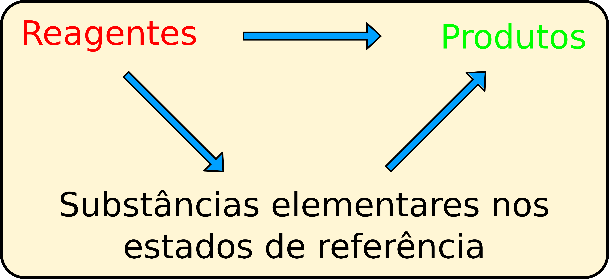

## Reações químicas
### A entalpia de reação

  Agora, podemos tratar os casos mais complexos: as <b>reações químicas</b>. Em reações químicas em fase gasosa, a pressão e temperatura constantes, a variação de entropia surge da quebra e formação de novas ligações químicas. Em fase condensada, há ainda uma contribuição da mudança de interações realizadas entre reagentes e solvente, e produtos e solvente - mas esses casos serão tratados mais adiante. Assim, podemos definir que a entalpia do sistema dependerá de pressão, temperatura, e do número de mols de cada espécie presente na reação. Vamos considerar a reação química genérica abaixo:

  

    $$aA(g) + bB(g) \to xX(g) + yY(g)$$
  

  
    
    EC12.1
  

  Assim como na equação de mudança de fase, a equação acima representa a reação entre $A$ e $B$, para formar $X$ e $Y$. Essa reação acontece segundo uma certa <b>estequiometria</b>: $a$ moléculas do tipo $A$ reagirão com $b$ moléculas do tipo $B$ para formar $x$ moléculas do tipo $X$ e $y$ moléculas do tipo $Y$. Os termos $a$, $b$, $x$ e $y$ são chamados de <b>coeficientes estequiométricos</b> e são adimensionais.

  De outra forma, podemos imaginar a equação química acima como uma equação matemática, e escrever:

  

    $$\begin{gather}
    aA(g) + bB(g) \to xX(g) + yY(g) \\
    - aA(g) - bB(g) + xX(g) + yY(g) = 0 \\
    \nu_A A(g) + \nu_B B(g) + \nu_X X(g) + \nu_Y Y(g) = 0
    \end{gather}$$
  

  
    
    EC12.2
  

e a última linha foi obtida fazendo $\nu_A = -a$, $\nu_B = -b$, $\nu_X = x$ e $\nu_Y = y$. Desta forma, fica claro que $\nu_i$ está relacionado com os coeficientes estequiométricos e, como estes, não possui unidades. Também, salientamos que $\nu_i$ é negativo para reagentes (serão consumidos) e positivo para produtos (serão formados). Com essa última equação, podemos escrever o diferencial total da entalpia, que será dada como uma função do tipo $H=H(p,T,n_i)$, sendo $n_i$ o número de mols da espécie $i$. Para uma reação composta por $k$ substâncias (entre reagentes e produtos), escrevemos:

  

    $$\color{blue}{\boldsymbol{dH = \left( \frac{\partial H}{\partial p}\right)_{T,n_i} dp + \left( \frac{\partial H}{\partial T}\right)_{p,n_i} dT + \sum_{i=1}^k \left( \frac{\partial H}{\partial n_i}\right)_{p,T,n_{j \ne i}}dn_i}}$$
  

  
    
    TC12.1
  

  A equação acima é bastante simplificada no caso em que a reação ocorre a pressão e temperatura constantes, pois aí apenas o último termo precisa ser avaliado:

  

    $$\begin{gather}
    dH = \sum_{i=1}^k \left( \frac{\partial H}{\partial n_i}\right)_{p,T,n_{j \ne i}} dn_i\\
    \color{blue}{\boldsymbol{dH = \sum_{i=1}^k \bar H_i dn_i }}
    \end{gather}$$
  

  
    
    TC12.2
  

e definimos acima a <b>entalpia parcial molar da espécie $\boldsymbol{i}$</b>, $\boldsymbol{\bar H_i}$. Ela é a variação da entalpia causada pela variação do número de mols da espécie $i$. Note que $\nu_i$ é positivo para os produtos, e negativo para os reagentes. Para uma reação química, que acontece de forma estequiométrica, podemos escrever que o número de mols da espécie $i$ em qualquer ponto da reação dependerá de uma variável que chamamos de <b>extensão da reação</b>, $\boldsymbol{\xi}$, através da expressão:

  

    $$\color{blue}{\boldsymbol{n_i = n_{0,i} + \nu_i \cdot \xi }}$$
  

  
    
    TC12.3
  

  Essa nova variável, $\xi$, é muito conveniente para tratarmos de reações químicas, pois ela acopla a variação do número de mols de todas as espécies: ao invés de descrevermos a variação do número de mols de cada espécie, podemos conectar todas as variações através de $\xi$. Notemos que $n_i$ possui dimensão de $mol$, enquanto $\nu_i$ é adimensional. Logo, a variável $\xi$ possui unidade de $mol$. Ao conectarmos o diferencial de $n_i$ com a equação <a href="#TC12.2" style="color: blue; font-style: italic;">TC12.2</a>, obtemos:

  

    $$\begin{gather}
    dH = \sum_{i=1}^k \nu_i \bar H_i d\xi\\
    \color{red}{\boldsymbol{\Delta_r H \equiv \left( \frac{\partial H}{\partial \xi} \right)_{p,T} = \sum_{i=1}^k \nu_i \cdot \bar H_i}}\\
    \color{blue}{\boldsymbol{\Delta_r H^o \equiv \left( \frac{\partial H^o}{\partial \xi} \right)_{p,T} = \sum_{i=1}^k \nu_i \cdot \bar H^o_i}}
    \end{gather}$$
  

  
    
    TC12.4a
    TC12.4b
  

  E definimos então a <b>entalpia da reação</b>, $\boldsymbol{\Delta_r H}$. Caso o processo ocorra no estado-padrão, então teremos a <b>entalpia-padrão da reação</b>, $\boldsymbol{\Delta_r H^o}$. Aqui, a variação de entalpia é devida exclusivamente às quebras e formações de ligações químicas, em reagentes e produtos. Agora, podemos escrever a equação termoquímica da reação-padrão de exemplo:

  

    $$aA(g) + bB(g) \to xX(g) + yY(g) \qquad \Delta_r H^o = z \ kJ.mol^{-1}$$    
  

  
    
    EC12.3
  

que reúne as informações de qual é a reação química e qual é a entalpia (padrão, no caso) dessa reação, a uma dada temperatura.

### A lei de Hess

  Apesar de correta, a equação acima não é prática de ser utilizada para cálculo de entalpias de reações, pois ela foi escrita em função da <b>entalpia parcial molar</b> das substâncias. A entalpia, contudo, é uma quantidade de energia. Logo, ela não possui um valor absoluto, sendo necessário calcular o valor da <b>variação</b> de entalpia em um processo. Uma das alternativas é <b>medirmos</b> o valor da entalpia de reações químicas e combinar diferentes reações para obtermos a reação de interesse e determinar o valor da entalpia dessa reação a partir das outras reações. Por exemplo, vamos considerar a seguinte equação termoquímica de interesse abaixo, a temperatura $T$ e pressão $p = 1 \ bar$:

  

    $$A(g) + B(g) \to X(g) + Y(g) \qquad \Delta_r H^o(T) = h \ kJ.mol^{-1}$$    
  

  
    
    EC12.4
  

que é a reação química de <a href="#EC12.1" style="font-weight: bold; color: black;">EC12.1</a> quando $a=b=x=y=1$. Aqui, a reação química nos diz que um equivalente de $A$ reage com um equivalente de $B$, para formar um equivalente de $X$ e um equivalente de $Y$. Devemos lembrar, contudo, que a entalpia é uma função de estado. Isso significa que não importa qual caminho a reação percorra de fato, o valor da entalpia de reações será sempre o mesmo (nas mesmas condições de pressão e temperatura). Assim, vamos considerar duas outras reações químicas, a temperatura $T$ e pressão $p = 1 \ bar$:

  

    $$\begin{gather}
    A(g) + D(g) \to X(g) \qquad \Delta_1 H^o(T) = m \ kJ.mol^{-1} \\
    B(g) \to D(g) + Y(g) \qquad \Delta_2 H^o(T) = n \ kJ.mol^{-1}
    \end{gather}$$
  

  

    EC12.5a
    EC12.5b
  

  A primeira reação (<a href="#EC12.5" style="font-weight: bold; color: black;">EC12.5a</a>) nos diz que um equivalente da substância $A$ reage com um equivalente da substância $D$, para formar um equivalente da substância $X$, com entalpia igual a $m \ kJ.mol^{-1}$. Já a segunda reação (<a href="#EC12.5" style="font-weight: bold; color: black;">EC12.5b</a>) nos diz que um equivalente de $B$ reage para formar um equivalente de $D$ e um equivalente de $Y$, com entalpia igual a $n \ kJ.mol^{-1}$. Vamos imaginar, agora, o seguinte processo com todas substâncias gasosa e no estado-padrão, a uma temperatura $T$:

  

1) Um recipiente contendo um equivalente da substância $B$, que irá se transformar em um equivalente de um a substância $D$ e um equivalente de $Y$;  
2) Adicionamos a esse recipiente um equivalente da substância $A$, que irá reagir com um equivalente da substância $D$ para formar um equivalente da substância $X$.

  Mas qual foi a transformação que realmente aconteceu? Do ponto de vista de $D$, um equivalente seu foi formado na primeira reação, mas um equivalente foi consumido na segunda. Logo, do ponto de vista de $D$, <b>não houve transformação</b> - a quantidade final e inicial da substância é a mesma! Por outro lado, $A$ e $B$ foram consumidos, enquanto $X$ e $Y$ foram formados. Logo, o processo como um todo pode ser escrito como:

  

    $$\begin{gather}    
    B(g) \to \cancel{D(g)} + Y(g) \qquad \Delta_{2} H^o(T) = n \ kJ.mol^{-1}\\
    A(g) + \cancel{D(g)} \to X(g) \qquad \Delta_{1} H^o(T) = m \ kJ.mol^{-1}
    \end{gather}$$
    

    $$A(g) + B(g) \to X(g) + Y(g) \qquad \Delta_r H^o(T) = h \ kJ.mol^{-1} = (m+n) \ kJ.mol^{-1}$$
  

  
    
    EC12.6
  

  Ou seja, o processo global acima é a reação química <a href="#EC12.4" style="font-weight: bold; color: black;">EC12.4</a>! Isso significa que, mesmo que não tenhamos feito essa reação diretamente, o caminho escolhido saiu dos mesmos reagentes iniciais ($A$ e $B$) e levou aos mesmos produtos finais ($X$ e $Y$), nas mesmas quantidades. Por ser uma função de estado e extensiva, a variação total de entalpia deverá ser a soma das entalpias de cada passo realizado. Logo, concluímos que $h = m+n$ e vemos que é possível determinar a entalpia de qualquer reação a partir da combinação (soma) de outras equações químicas - desde que todos reagentes e produtos se encontrem nos mesmos estados (pressão, temperatura e estados físicos) da reação de interesse. Tal princípio é conhecido como a <b>lei de Hess</b>.

  A lei de Hess é de grande utilidade prática: ao invés de terminar o valor de $\Delta_r H^o$ de uma determinada reação, podemos simplesmente escrever a reação de interesse como uma combinação de outras reações, cujo valor de entalpia-padrão de reação seja conhecido, e teremos o valor do calor da reação desejada. Enquanto essa observação é fundamental e de imenso potencial, a sua aplicação direta pode ser difícil, pois as entalpias de algumas reações precisarão ser determinadas para que possamos combiná-las e formar as reações de interesse. Logo, nos perguntamos: quais reações serão tabuladas para esta finalidade? Tabular <b>todas</b> as reações não é possível, pois esse número é incrivelmente grande. Poderíamos pensar em reações muito utilizadas, como as reações de combustão e hidrogenação. Elas, contudo, não são a melhor opção, pois nem todos materiais são combustíveis e nem sofrem hidrogenação (apesar de serem largamente utilizadas em algumas áreas da ciência e engenharia). O mesmo vale para as reações de oxidacão e redução (utilizadas em áreas como a química medicinal/bioquímica e eletroquímica). É necessário criarmos um tipo de reação que seja geral para todos os tipos de compostos, para que possamos combinar os mais diversos reagentes para formar os produtos de interesse. Então quais reações utilizar?

## A reação-padrão de formação

  A saída encontrada para este problema é simples e elegante. Definiremos agora a <b>reação-padrão de formação</b> de um composto, em um determinado estado físico e a uma certa temperatura, na forma:

  <i>"A reação-padrão de formação de uma substância, em um determinado estado físico e a uma dada temperatura, é a reação de formação de um mol dessa substância, nessas condições, a partir de <b>substâncias elementares</b> em seus <b>estados de referência</b>, que são seus estados físicos e formas alotrópicas mais estáveis naquela temperatura."</i>

  Aqui, na definição de reação-padrão de formação, é onde aparece uma menção ao estado físico de substâncias a uma dada temperatura, e <b>não</b> na definição do estado-padrão, feita anteriormente. A definição acima determina tudo o que é necessário para escrevermos uma reação-padrão de formação de uma substância de interesse. Por exemplo, podemos escrever a reação padrão de formação de etanol líquido ($C_2 H_5 O H$), a $25 \ {}^oC$:

  

    $$\begin{gather}    
    2 C(grafite) + 3 H_2(g) + \tfrac{1}{2} O_2 \to C_2 H_5 O H(l)
    \end{gather}$$    
  

  
    
    EC12.7
  

  Notem que a equação química acima possui os coeficientes estequiométricos necessários para que um mol de produto seja formado. Além disso, para escrever a equação acima, é necessário saber apenas qual é o estado físico e forma alotrópica mais estáveis dos reagentes ($C$ na forma de grafite, e $H_2$ e $O_2$ gasos, no caso).

### Equações termoquímicas

  Podemos escrever equações termoquímicas para as reações-padrão de formação de substâncias. Por exemplo, para a reação-padrão de formação de etanol líquido a 298 K, escrevemos:

  

    $$\begin{gather}    
    2 C(grafite) + 3 H_2 (g) + \tfrac{1}{2} O_2(g) \to H_2 O(l) \qquad \Delta H^o = -277,7 \ kJ.mol^{-1}
    \end{gather}$$    
  

  
    
    EC12.8
  

  De outra forma, a equação termoquímica acima pode ser toda sumarizada em apenas uma expressão: $\boldsymbol{\Delta_f H^o_{298}(C_2 H_5 OH,l) = -277,7 \ kJ.mol^{-1}}$. Chamamos o termo $\Delta_f H^o_T(i,ef)$ de <b>entalpia-padrão de formação</b> da substância $i$, em um estado físico $ef$, e a uma tempeartura $T$. A vantagem desta definição? É a possibilidade de escrever toda e qualquer reação química a partir de um conjunto pequeno de outras reações: processos químicos sempre conservam a quantidade de átomos de todos os elementos envolvidos na reação. Assim, podemos imaginar um ciclo no qual cada reagente, nas quantidades estequiométricas necessárias, irá formar suas respectivas substâncias elementares. Estas, por sua vez, irão se recombinar para fomar os produtos, também em quantidades estequiométricas! Mesmo que o caminho efetivamente tomado não seja esse, essa diferença não importa para o cálculo da entalpia da reação - e nem para a reação global, o que foi consumido e produzido de fato.

<b>Figura 3.</b> Um ciclo levando dos reagentes aos produtos por dois caminhos: diretamente, ou passando para as substâncias elementares que, em seguida, formarão os produtos.

  Vamos analisar a reação-padrão em fase gasosa entre amônia e metanol, a 298 K e com todas as substâncias no estado-padrão, formando dietilamina e água:

