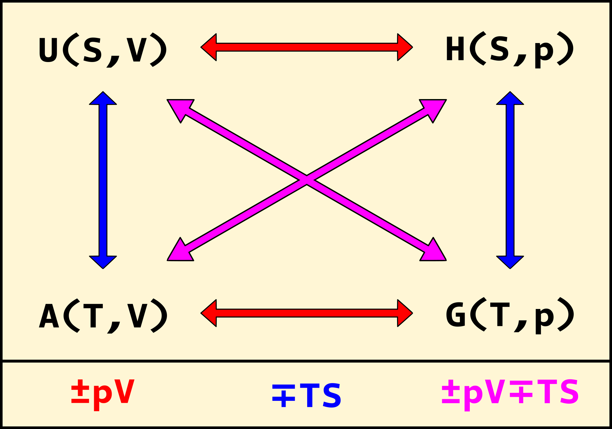

## A entropia não é critério global de espontaneidade

  Vimos que, em sistemas isolados, a espontaneidade de transformações pode ser definida apenas a partir do sinal da variação de entropia (<a href="../A8/#TC8.6" style="color: blue; font-style: italic;">TC8.6</a>). No entanto, a maior parte dos sistemas químicos de interesse são fechados ou abertos, mas raramente isolados. Nesses casos, não é possível determinar qual é a direção espontânea de transformações apenas com a variação de entropia - outras grandezas termodinâmicas também contribuem. Um exemplo simples é observarmos o que acontece com um cubo de gelo em um recipiente aberto, a $25 \ {}^o C$. Ao longo do tempo, o gelo vai se transformando em líquido, em um processo de fusão. Esse é um processo <b>endotérmico</b> e espontâneo, no qual há variação de entropia do sistema, mas também da vizinhança. Para tratar sistemas como esse, precisamos criar um novo critério.

## A energia de Helmholtz, $A$

  Em meados de 1800, R. Clausius introduziu a famosa <i>desigualdade de Clausius</i>, que diz:

  

    $$\begin{gather}    
    \color{blue}{\boldsymbol{dS \ge \frac{đq}{T}}}
    \end{gather}$$
  

  
    
    TC14.1
  

e essa equação é definida para um sistema em contato com a vizinhança - isto é, ele não está isolado. Nesse caso, a variação de entropia será positiva para processos espontâneos e igual a zero para processos reversíveis. Podemos utilizar a forma diferencial da 1a. Lei da Termodinâmica (<a href="../A7/#TC7.5" style="color: blue; font-style: italic;">TC7.5</a>), substituindo $đq$ na expressão acima, e em um processo a temperatura e volume constantes obteremos:

  

    $$\begin{gather}
    TdS \ge dU - đw\\
    0 \ge dU - TdS + pdV\\
    \color{red}{\boldsymbol{0 \ge d(U - TS)}}\\
    \color{blue}{\boldsymbol{0 \ge dA}}
    \end{gather}$$
  

  
    
    TC14.2a
    TC14.2b
  

  E definimos acima a <b>energia de Helmholtz</b>, $\boldsymbol{A}$:

  

    $$\begin{gather}    
    \color{blue}{\boldsymbol{A \equiv U - TS}}
    \end{gather}$$
  

  
    
    TC14.3
  

  Assim, criamos um novo critério de espontaneidade que serve para sistemas que podem trocar energia com a vizinhança! Caso $\boldsymbol{\Delta A \le 0}$, então o processo será espontâneo ($\Delta A < 0$) ou estará no equilíbrio ($\Delta A = 0$). Caso $\Delta A > 0$, então o processo <b>não é espontâneo</b> e trabalho precisa ser realizado para que a transformação ocorra. Notemos também, que a definição de $A$ dada em <a href="#TC14.3" style="color: blue; font-style: italic;">TC14.3</a> é do negativo da transformada de Legendre de $U$, trocando $S$ por $T$! Enquanto $H$ foi criada a partir de $U$, trocando $V$ por $-p$, aqui trocamos a outra dupla de variáveis conjugadas de $U=U(S,V)$. Assim, é de se esperar que $A=A(T,V)$, e de fato:

  

    $$\begin{gather}
    A \equiv U - TS\\
    dA = dU - d(TS)\\    
    \color{blue}{\boldsymbol{dA = -SdT - pdV}}
    \end{gather}$$
  

  
    
    TC14.4
  

  Uma das formas de atribuir um significado físico para a variação de energia interna é dizer que essa é a quantidade de energia trocada na forma de calor em um processo realizado a volume constante. Também, definimos a variação de entalpia como o análogo da energia interna, mas para uma transformação a pressão constante. E o significado físico de $A$? Podemos obtê-lo a partir do seu diferencial total:

  
    
    $$\begin{gather}
    dA = dU - d(TS)\\
    dA = đq_{rev} + đw_{rev} - TdS - SdT \\
    dA = đw_{rev} - SdT \\
    \color{blue}{\boldsymbol{dA = đw_{rev}}}
    \end{gather}$$
  

  
    
    TC14.5
  

e a última linha foi obtida fixando o valor da temperatura. Ou seja, em um processo a temperatura constante, o diferencial da energia de Helmholtz é igual ao diferencial do trabalho reversível em um processo. Contudo, vimos anteriormente que o caminho reversível é o caminho pelo qual extraímos a maior quantidade de trabalho possível de uma transformação, ou o caminho pelo qual realizamos a menor quantidade de trabalho possível para promover a alteração. Assim, podemos afirmar que a energia de Helmholtz é <b>o trabalho máximo reversível</b> que pode ser extraído de uma transformação espontânea, ou o <b>trabalho mínimo reversível</b> que precisa ser realizado em um processo não-espontâneo. Essa interpretação é também o motivo para o nome da grandeza, $A$, em Química - vem da palavra <i>arbeit</i>, trabalho em alemão. É também a razão de essa grandeza ser chamada de $F$ em livros de Física - por causa da palavra <i>frei</i>, que significa livre. Antigamente, essa grandeza era chamada de <i>energia livre de Helmholtz</i>, mas a IUPAC sugere não utilizar mais o termo "livre".

  Esse termo, "livre", foi cunhado pelo próprio Helmholtz, na derivação da quantidade $A$. Isso porque ele seria o trabalho "disponível" para ser extraído de um sistema quando o processo é conduzido de forma isotérmica. A idéia é que a conversão de $U$ em trabalho, a uma temperatura fixa, não pode ser completa - parte da energia interna é utilizada para a manutenção da temperatura, deixando apenas uma fração utilizável para se transformar em trabalho. Essa quantidade resultante é a parte "livre" da energia. Assim, vemos que o trabalho não é livre no sentido de ser "grátis", mas sim o trabalho disponível para ser utilizado. Por uma questão de clareza de nomenclatura, seguiremos aqui a recomendação da IUPAC ao nos referirmos a $A$ (ou à energia de Gibbs, como veremos agora), apesar deste termo ser encontrado em diversos livros (mais antigos, no geral) de Físico-Química.

  Além de ser um novo critério de espontaneidade, essa nova grandeza tem uma outra vantagem: a sua variável é $T$ e não mais $S$, como no caso de $U$ e $H$. Isso significa que podemos controlar as variações de $A$ com variações de $T$, fazendo com que o arranjo experimental seja consideravelmente mais simples. Assim, $A$ é de grande utilidade em processos nos quais controlamos o volume e a temperatura. Contudo, como já discutido, temos um interesse especial na Química em processos nos quais controlamos a pressão ao invés do volume. Como $H$ não é um critério de espontaneidade, precisamos criar uma nova variável que seja, mas que dependa de $p$.

## A energia de Gibbs, $G$

  Para isso, vamos partir da desigualdade de Clausius (<a href="#TC14.1" style="color: blue; font-style: italic;">TC14.1</a>) e combiná-la com a forma diferencial da equação <a href="../A8/#TC8.6" style="color: blue; font-style: italic;">TC8.6</a>. Contudo, vamos considerar um processo com temperatura e pressão fixas:

  

    $$\begin{gather}
    TdS \ge dU - đw\\
    0 \ge dU - TdS + pdV\\
    \color{red}{\boldsymbol{0 \ge d(U - TS + pV)}}\\
    \color{blue}{\boldsymbol{0 \ge dG}}
    \end{gather}$$
  

  
    
    TC14.6a
    TC14.6b
  

e definimos na última linha a <b>energia de Gibbs</b>, $\boldsymbol{G}$:

  

    $$\begin{gather}    
    \color{blue}{\boldsymbol{G \equiv U - TS + pV}}
    \end{gather}$$
  

  
    
    TC14.7
  

  Assim como a energia de Helmholtz, $G$ é um critério de espontaneidade para sistemas que não estão isolados! Caso $\boldsymbol{dG \le 0}$, então o processo será espontâneo ($dG \lt 0$) ou estará no equilíbrio ($dG = 0$). Caso $dG \gt 0$, então o processo <b>não será espontâneo</b>, e será necessário realizar trabalho sobre o sistema para que a transformação ocorra. Podemos notar que a equação <a href="#TC14.7" style="color: blue; font-style: italic;">TC14.7</a> é a definição do negativo da transformada dupla de Legendre de $U$, passando de $V$ para $-p$ e de $S$ para $T$! Assim, esperamos que a nova função seja da forma $G=G(T,p)$. Analisando o diferencial total de $G$:

  

    $$\begin{gather}
    G \equiv U - TS + pV\\
    dG = dU - d(TS) + d(pV)\\    
    \color{blue}{\boldsymbol{dG = -SdT +Vdp}}
    \end{gather}$$
  

  
    
    TC14.8
  

confirmando o resultado esperado a partir da transformada de Legendre. Agora, podemos fornecer uma interpretação física de $G$. Para isso, vamos escrever o seu diferencial separando o termo de trabalho em duas contribuições, uma relacionada ao processo de expansão/compressão de gases, e outra com os termos restantes (<a href="../../#TC7.6" style="color: red; font-style: italic;">TC7.6b</a>). Em um processo a $T$ e $p$ constantes, teremos:

  
    
    $$\begin{gather}
    dG = dU - d(TS) + d(pV)\\
    dG = đq_{rev} + đw_{rev} - TdS - SdT + pdV + Vdp\\
    dG = -SdT + Vdp + đw_{ñ-e/c}\\
    \color{blue}{\boldsymbol{dG = đw_{rev,ñ-e/c}}}
    \end{gather}$$
  

  
    
    TC10.5
  

  E, fazendo uma análise similar à feita para $dA$, podemos definir $dG$ como o trabalho máximo reversível extraído de um processo espontâneo ou o trabalho mínimo reversível necessário para realizar uma transformação não-espontânea, excetuando o trabalho de expansão/compressão. Assim como $A$, a energia de Gibbs também era chamada de energia "livre", devido aos mesmos motivos - mas essa grandeza foi obtida por W. Gibbs e não por Helmholtz. Também utilizaremos o nome sugerido pela IUPAC - energia de Gibbs.

## Relações entre as funções e análise de curvatura

  Fica claro a partir das relações estabelecidas que é possível escrever cada energia ($U$, $H$, $A$ e $G$) como a transformada de Legendre de qualquer uma das outras. Apesar de termos iniciado pela energia interna e escrito as outras a partir daí, é possível recuperar $U$ a partir de $G$, por exemplo. A Figura 1 estabelece a relação entre as energias, dizendo quais variáveis conjugadas serão trocadas passando de uma grandeza para outra.

<b>Figura 1.</b> As relações entre $U$, $H$, $A$ e $G$. As setas vermelhas indicam que as variáveis $-p$ e $V$ serão trocadas, as setas azuis indicam que as variáveis $T$ e $S$ serão trocadas e as setas roxas indicam uma troca dupla, $-p$ e $V$, $T$ e $S$.

  Por fim, podemos analisar o que acontece com a concavidade/convexidade das novas funções criadas. Como discutido anteriormente, $U$ é uma função convexa com relação a $S$ e $V$. Quando criamos $H$, afirmamos que ela manteria a convexidade com relação a variável que não foi trocada, $S$, mas que agora seria côncava com relação a nova variável, $p$. Isso é uma consequência da transformada de Legendre, na forma feita na termodinâmica: sempre que trocamos uma variável, trocamos também a curvatura da função com relação a nova variável, mas mantemos a curvatura da variável que não trocamos! Isso significa que $A$ é côncava com relação a $T$, mas convexa com relação a $V$, enquanto $G$ é côncava com relação a ambas as variáveis, $T$ e $p$. A Tabela 14.1 sumariza essas definições, junto com a discussão anterior de $S$.

  <table class="table-content">
    <thead>
      <tr>
        <th>Grandeza termodinâmica</th>
        <th>Variável 1, Variável 2</th>
        <th>Curvatura 1, Curvatura 2</th>        
      </tr>
    </thead>
    <tbody>
      <tr>
        <td>$U$</td>
        <td>$S$, $V$</td>
        <td>convexa, convexa</td>        
      </tr>
      <tr>
        <td>$H$</td>
        <td>$S$, $p$</td>
        <td>convexa, côncava</td>
      </tr>
      <tr>
        <td>$A$</td>
        <td>$T$, $V$</td>
        <td>côncava, convexa</td>
      </tr>
      <tr>
        <td>$G$</td>
        <td>$T$, $p$</td>
        <td>côncava, côncava</td>
      </tr>
      <tr>
        <td>$S$</td>
        <td>$U$, $V$</td>
        <td>côncava, côncava</td>
      </tr>
    </tbody>
  </table>

  Notemos que quando a variável da energia é extensiva, a função é convexa, mas se a variável é intensiva, a função é côncava. Existe um motivo para isso: a curvatura das funções, a depender da variável analisada, garante a <b>estabilidade termodinâmica</b> de sistemas. Caso as curvaturas fossem diferentes do que são, separações de fase mesmo em sistemas homogêneos com uma única fase seriam observadas. Diferentemente das outras quantidades, $S$ é côncava com relação a ambas as variáveis, mesmo que estas sejam grandezas extensivas - mas $S$ <b>não é</b> uma energia.

  Essas duas grandezas, $A$ e $G$, estabelecem novos critérios de espontaneidade em transformações físico-químicas, e ainda possuem significados físicos de grande utilidade. Agora que todas as grandezas foram definidas, vamos olhar para o diferencial total delas em conjunto - $U$, $H$, $A$ e $G$ - pois algumas relações podem ser estabelecidas.

