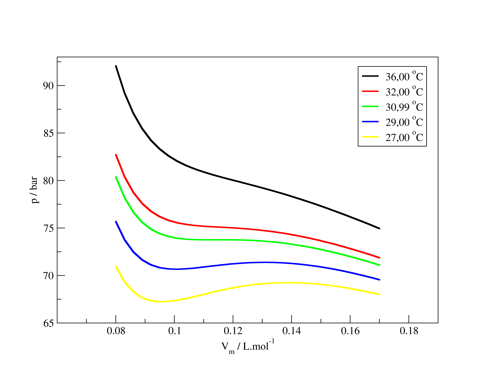

Como vimos, as equações de estado de gases reais têm como objetivo capturar a relação real entre as variáveis do conjunto completo para gases que não se comportam idealmente. Também vimos que esse desvio possui duas raízes: gases reais não são puntiformes, i.e., eles ocupam um volume no espaço, e as moléculas podem interagir umas com as outras, dando origem às interações intermoleculares. Agora, vamos ver que é possível relacionar os parâmetros dessas equações com essas propriedades moleculares – tamanho e capacidade de interagir com outras moléculas.

Uma forma possível de se fazer isso é através do teorema do virial. No desenvolvimento inicial (TC2.1), consideramos um sistema composto por $N$ moléculas e que a força exercida por um átomo sobre os outros seria zero, fazendo com que a equação tivesse apenas dois termos – um de energia cinética e outro de colisão com as paredes do recipiente. Agora, vamos considerar um sistema formado por $N$ moléculas esféricas (sem estrutura interna) idênticas, no qual as interações intermoleculares estão presentes, mas apenas na forma de interações radiais aditivas por pares – isto é, a força total exercida na molécula $i$ pelas outras $j \ne i$ moléculas do sistema é dada pela soma de $N – 1$ forças oriundas do potencial de interação radial por pares. Graças a essas propriedades, podemos definir que $\vec F_{i,j} = -\vec F_{j,i}$, i.e., a força exercida na molécula $i$ pela molécula $j$ é igual ao oposto da força exercida na molécula $j$ pela molécula $i$. Caso definamos o vetor distância entre a molécula $i$ e a molécula $j$ na forma , então podemos manipular a equação TC2.1 para obter:

  

    $$\color{blue}{\boldsymbol{\bar V^3 - \frac{RT}{p} \bar V^2 - \left( B^2 + \frac{BRT}{p} - \frac{A}{p T^{1/2}} \right) \bar V - \frac{AB}{p T^{1/2}}= 0}}$$
  

  

    TC4.1
  

A equação acima sugere que há uma dependência cúbica entre volume molar e pressão em uma isoterma. Então, quando construímos as isotermas de pressão em função do volume, utilizando a equação de RK, por exemplo, obteremos o seguinte gráfico na região de temperatura entre 27 &deg;C e 36 &deg;C (Figura 1).

{: .mx-auto.d-block :}

<b>Figura 1.</b> Isotermas de pressão vs volume molar para CO2 na faixa de temperatura entre 27 a 36 &deg;C.

