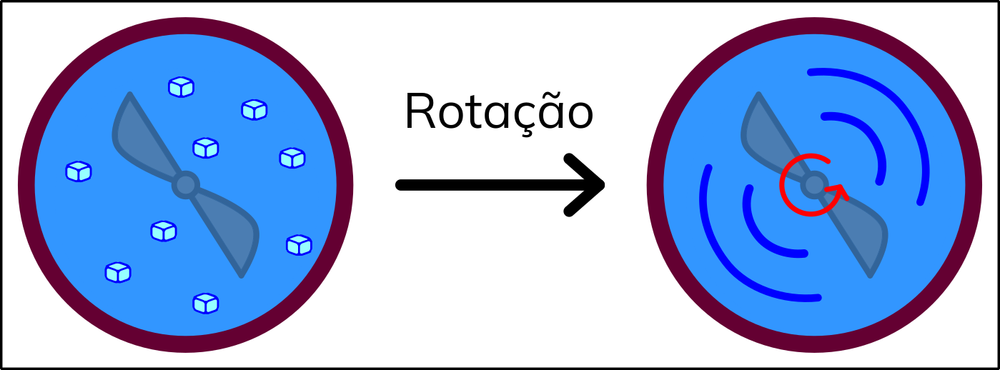

A Termodinâmica pode ser definida como a área de estudo da relação entre energia, trabalho, calor e temperatura. Até agora, definimos a temperatura do ponto de vista <b>microscópico</b>, relacionando-a com a energia cinética média das moléculas do sistema (<a href="../A2/#TC2.4" style="color: blue; font-style: italic;">TC2.4</a>). Ainda veremos outras definições para a temperatura, incluindo o ponto de vista da termodinâmica clássica. Antes disso, devemos definir mais rigorosamente o que são as outras quantidades: energia, trabalho e calor.

## Trabalho termodinâmico é função de caminho

Pela mecânica clássica, o trabalho causado pelo deslocamento infinitesimal, $\vec {ds}$, de um corpo por ação de uma força, $\vec F$, é dado por:

  

    $$\color{blue}{\boldsymbol{đw = \vec F \cdot \vec {ds} = F_s ds}}$$
  

  

    TC7.1
  

e se os vetores possuem mesma direção e sentido, então a última igualdade é obtida (o termo $F_s$ enfatiza isso).

  Essa força pode possuir duas origens distintas: a primeira são aquelas provenientes de potenciais, como por exemplo os de interação intermolecular. Essas forças podem ser definidas como o negativo do gradiente do potencial e são chamadas de <b>forças conservativas</b>. Por ora, não trataremos dessas forças, mas sim das pertencentes ao segundo grupo. O segundo grupo de forças é oriundo de forças externas, que não são originadas a partir de potenciais. Tais forças são chamadas de <b>não conservativas</b>, ou <b>dissipativas</b>. Para este segundo grupo de forças, o trabalho deverá ser escrito na forma:

  

    $$\color{blue}{\boldsymbol{w = \int_C F_s {ds}}}$$
  

  

    TC7.2
  

  sendo aqui $C$ o caminho específico tomado. Para que o trabalho seja calculado, é necessário saber o caminho tomado, pois a força varia ao longo do caminho. Assim, não existe um "trabalho inicial", nem um "trabalho final": trabalho é próprio processo. Isso faz com que a integração do lado esquerdo da equação <a href="#TC7.2" style="color: blue; font-style: italic;">TC7.2</a> não seja uma diferença, mas apenas $w$. Esse tipo de propriedade, que depende de qual foi o caminho tomado, é chamada de <b>função de caminho</b>, e o trabalho é um exemplo. O diferencial dessas quantidades será denotado por <b>đ</b>, neste curso - para indicar que o diferencial é <b>inexato</b>, as diferenciando dos diferenciais <b>exatos</b>, oriundos das forças conservativas.

  Existem diferentes formas de se realizar trabalho na termodinâmica, mas o mais simples de todos, é o trabalho de <b>expansão/compressão</b> (e/c) de um gás. Vamos considerar um pistão com êmbolo móvel, sobre o qual uma força externa $F_{ext}$ está sendo exercida ao longo do eixo $s$, onde haverá deslocamento. Sabendo que esta se relaciona com a pressão externa ($p_{ext}$) e a área ($A$) sobre a qual a força está sendo exercida, podemos manipular a equação <a href="#TC7.2" style="color: blue; font-style: italic;">TC7.2</a> para obter:

  

    $$\color{blue}{\boldsymbol{w = \int_C -F_{ext} ds = -\int_C p_{ext} Ads = -\int_C p_{ext} dV}}$$
  

  

    TC7.3
  

  pois o produto do deslocamento de altura do êmbolo no eixo s pela área do mesmo é a própria variação de volume do sistema. Em cursos de Química, no geral, o sinal negativo é colocado na frente da equação por uma questão de referencial. <b>Compressões</b>, que levam à diminuição do volume do sistema, fazem com que o trabalho seja positivo, pois a pressão é necessariamente positiva. Já <b>expansões</b>, que levam ao aumento do volume do sistema, são negativas. No primeiro caso, dizemos que trabalho foi realizado <b>sobre o sistema</b>. No segundo, dizemos que trabalho foi realizado <b>pelo sistema</b>.

  A expressão para o trabalho em <a href="#TC7.3" style="color: blue; font-style: italic;">TC7.3</a> foi modificada para trabalharmos com as variáveis mais práticas em sistemas gasos. Contudo, ela continua sendo uma expressão que depende do caminho tomado. O problema é que a quantidade de caminhos possíveis entre um estado inicial e um final é incontável. Assim, vamos nos concentrar nos três caminhos mais comuns/simples.

## A energia interna: processos adiabáticos

  Vamos considerar um sistema formado por um gás confinado em um pistão que possua paredes adiabáticas, em um sistema fechado. Neste caso, não será possível trocar matéria (sistema fechado) e nem haver processos de calor, mas apenas trabalho de e/c poderá ser realizado. Para estes sistemas, uma observação fundamental da termodinâmica é constatada: caso um sistema saia de um determinado estado inicial, $i$, para um estado final, $f$, então não importa o caminho tomado e o trabalho será sempre o mesmo. Isso significa que este trabalho, diferentemente dos outros trabalhos de e/c, não depende do caminho percorrido, mas apenas dos estados final e inicial. Logo, podemos concluir que esse trabalho é uma <b>diferença entre valores de uma propriedade do sistema!</b>. Chamamos essa propriedade de <b>energia interna, U</b>. Daí, podemos escrever:

  

    $$\color{blue}{\boldsymbol{w_{ad} = U_f - U_i = \Delta U}}$$
  

  

    TC7.4
  

  Para estes processos, outra observação fundamental é obtida: o volume que um gás ocupa e a sua temperatura são inversamentes proporcionais. Isto é, em uma expansão adiabática, a temperatura diminui e, em uma compressão adiabática, a temperatura aumenta. Voltaremos a essa observação logo mais.

## A formulação da 1ᵃ. Lei da Termodinâmica

  Agora, podemos imaginar dois processos distintos: vamos imaginar um sistema, que passa por um processo de e/c, saindo de um determinado estado inicial e chegando em um outro estado final, através de um caminho qualquer. Agora, podemos imaginar exatamente o mesmo processo, sobre o mesmo sistema, mas utilizando uma parede adiabática. Neste caso, veremos que o trabalho realizado é diferente entre o caminho com paredes adiabáticas e o caminho tomado com paredes diatérmicas. Essa diferença é <b>definida</b> como sendo o <b>calor</b>, $\boldsymbol{q}$, na forma:

  

    $$ q \equiv w_{ad} - w \\
    \color{blue}{\boldsymbol{\Delta U = q + w}}$$
  

  

    TC7.5
  

  e a equação <a href="#TC7.5" style="color: blue; font-style: italic;">TC7.5</a> é conhecida como <b>1ᵃ. Lei da Termodinâmica</b>. Ela é a lei de <b>conservação de energia</b>, que diz que a energia não pode ser criada nem destruída, apenas convertida uma na outra. Podemos imaginar a energia interna como sendo um grande reservatório, de onde podemos extrair calor ou trabalho ($\Delta U \lt 0$), diminuindo a energia interna do sistema, ou onde depositamos calor e trabalho ($\Delta U \gt 0$), aumentando a energia interna do sistema. Notamos, por fim, que, se a variação de energia interna não de depende do caminho, mas o trabalho sim, então o calor será também uma função de caminho, necessariamente. Para dois caminhos distintos, com mesmos estados inicial e final, o $w$ será diferente, mas $\Delta U$, não. Assim, $q$ varia com o caminho tomado, fazendo com que a variação de energia interna seja a mesma nos dois caminhos.

  A energia interna é, portanto, uma <b>função de estado</b>, isto é, uma função que depende apenas dos estados final e inicial do sistema. Funções de estado são fundamentais em termodinâmica. O motivo? Dentre outros, elas permitem que, dois cientistas, em lugares diferentes do mundo, trabalhando com o mesmo sistema, possam reportar propriedades deste sem se preocupar com o caminho tomado, mas apenas os estados inicial e final. Isso é de grande auxílio experimental, pois é muito difícil reproduzir exatamente o mesmo caminho entre dois pontos, com equipamentos e reagentes diferentes!

  Considere um sistema composto por água e gelo, em equilíbrio, confinado por paredes adiabáticas. Podemos imaginar uma hélice nesse sistema, por onde poderemos realizar trabalho de rotação. Pela 1ᵃ. Lei da Termodinâmica, o trabalho realizado será transformado em energia interna - caso o rotor seja ideal, todo o trabalho realizado será transformado em energia interna, sem dissipação. Esse trabalho irá, eventualmente, promover a transição de fase do gelo para a fase líquida, como na Figura 1.

  <!-- Optimized & Re-framed SVG Asset -->
  <svg viewBox="68.5 60 64 64" version="1.1" id="svg5" xmlns="http://www.w3.org/2000/svg">
    <defs id="defs2" />
    <g id="layer1">
      <g id="g19899">
        <g id="g2073">
          <g id="g19622">
            <!-- Main Rigid Adiabatic Boundary & Fluid Vessel -->
            <circle style="fill:#3296ff;fill-opacity:1;stroke:#640032;stroke-width:3;stroke-linecap:round;stroke-miterlimit:0;stroke-dasharray:none;stroke-opacity:1" id="path5800-3" cx="100.57224" cy="91.912193" r="28.313526" />
            
            <!-- JavaScript Controlled Dynamic Flow Ripples -->
            <g id="motion-waves" transform="translate(-69.588642,40.733485)" style="opacity: 0;">
              <g id="g422" transform="translate(-0.20180659,0.04682544)">
                <path style="fill:none;fill-opacity:1;stroke:#0000ff;stroke-width:1.35;stroke-linecap:round;stroke-miterlimit:0;stroke-dasharray:none;stroke-opacity:1" d="m 151.55999,48.081229 c -2.6414,7.177538 0.425,13.696455 3.56954,17.401855 3.36059,3.960067 9.61888,6.329161 15.87384,5.671712" id="path12619" />
                <path style="fill:none;fill-opacity:1;stroke:#0000ff;stroke-width:1.35;stroke-linecap:round;stroke-miterlimit:0;stroke-dasharray:none;stroke-opacity:1" d="m 189.16537,54.182542 c 2.6414,-7.177538 -0.425,-13.696455 -3.56954,-17.401855 -3.36059,-3.960067 -9.61888,-6.329161 -15.87384,-5.671712" id="path12619-6" />
              </g>
              <g id="g426" transform="translate(-0.46639159,0.04682544)">
                <path style="fill:none;fill-opacity:1;stroke:#0000ff;stroke-width:1.5;stroke-linecap:round;stroke-miterlimit:0;stroke-dasharray:none;stroke-opacity:1" d="m 159.07976,51.763374 c -1.3207,3.588769 0.2125,6.848228 1.78477,8.700928 1.6803,1.980033 4.80944,3.16458 7.93692,2.835856" id="path12619-2" />
                <path style="fill:none;fill-opacity:1;stroke:#0000ff;stroke-width:1.5;stroke-linecap:round;stroke-miterlimit:0;stroke-dasharray:none;stroke-opacity:1" d="m 182.17477,50.500397 c 1.3207,-3.588769 -0.2125,-6.848228 -1.78477,-8.700928 -1.6803,-1.980033 -4.80944,-3.16458 -7.93692,-2.835856" id="path12619-2-0" />
              </g>
            </g>

            <!-- Concentric Rotator Wrapper for Mechanical Axis Calibration -->
            <g id="stirrer-container">
              <g id="stirrer" transform="translate(58.560421,-3.7455229)">
                <circle style="fill:#646464;fill-opacity:1;stroke:#323232;stroke-width:1;stroke-linecap:round;stroke-miterlimit:0;stroke-dasharray:none;stroke-opacity:1" id="path8601-7" cx="42.038895" cy="95.65477" r="2.0673883" />
                <g id="g10217-5">
                  <g id="g10140-3">
                    <path style="fill:#646464;fill-opacity:0.5;stroke:#323232;stroke-width:1;stroke-linecap:round;stroke-miterlimit:0;stroke-dasharray:none;stroke-opacity:1" d="M 41.057472,93.609632 32.109084,79.562692" id="path10109-56" />
                    <path style="fill:none;fill-opacity:0.5;stroke:#323232;stroke-width:1;stroke-linecap:round;stroke-miterlimit:0;stroke-dasharray:none;stroke-opacity:1" d="m 39.890218,94.885154 c 0,0 -8.959473,-3.207198 -10.228742,-6.51679 -1.269269,-3.309592 2.447608,-8.805672 2.447608,-8.805672" id="path10109-5-29" />
                  </g>
                  <path style="fill:#646464;fill-opacity:1;stroke:#323232;stroke-width:0.452894;stroke-linecap:round;stroke-miterlimit:0;stroke-dasharray:none;stroke-opacity:1" d="m 147.32419,355.17668 c -17.55296,-7.07113 -29.62163,-14.73284 -32.88245,-20.87521 -2.32779,-4.38482 -1.66084,-11.30554 1.92473,-19.97226 1.46271,-3.53554 4.89917,-10.16219 5.09231,-9.81971 0.0476,0.0844 7.12797,11.20633 15.73417,24.71543 l 15.64765,24.56201 -0.82481,0.84155 c -0.45365,0.46285 -0.98137,1.06296 -1.17271,1.33358 l -0.34789,0.49203 z" id="path10211-1" transform="scale(0.26458333)" />
                </g>
                <g id="g10217-1-2" transform="rotate(180,42.011816,95.657719)">
                  <g id="g10140-1-7">
                    <path style="fill:#646464;fill-opacity:0.5;stroke:#323232;stroke-width:1;stroke-linecap:round;stroke-miterlimit:0;stroke-dasharray:none;stroke-opacity:1" d="M 41.057472,93.609632 32.109084,79.562692" id="path10109-59-0" />
                    <path style="fill:none;fill-opacity:0.5;stroke:#323232;stroke-width:1;stroke-linecap:round;stroke-miterlimit:0;stroke-dasharray:none;stroke-opacity:1" d="m 39.890218,94.885154 c 0,0 -8.959473,-3.207198 -10.228742,-6.51679 -1.269269,-3.309592 2.447608,-8.805672 2.447608,-8.805672" id="path10109-5-8-9" />
                  </g>
                  <path style="fill:#646464;fill-opacity:1;stroke:#323232;stroke-width:0.452894;stroke-linecap:round;stroke-miterlimit:0;stroke-dasharray:none;stroke-opacity:1" d="m 147.32419,355.17668 c -17.55296,-7.07113 -29.62163,-14.73284 -32.88245,-20.87521 -2.32779,-4.38482 -1.66084,-11.30554 1.92473,-19.97226 1.46271,-3.53554 4.89917,-10.16219 5.09231,-9.81971 0.0476,0.0844 7.12797,11.20633 15.73417,24.71543 l 15.64765,24.56201 -0.82481,0.84155 c -0.45365,0.46285 -0.98137,1.06296 -1.17271,1.33358 l -0.34789,0.49203 z" id="path10211-4-3" transform="scale(0.26458333)" />
                </g>
              </g>
            </g>

            <!-- Internal Matrix System Phase Boundary (Water Layer Overlay) -->
            <circle style="fill:#3296ff;fill-opacity:0.5;stroke:none;stroke-width:0.791439;stroke-linecap:round;stroke-miterlimit:0" id="path483-60" cx="100.57224" cy="91.912193" r="23.434507" />
            
            <!-- Dissipating Solid Phase (Ice Microstates) -->
            <g id="ice-cubes" transform="translate(-18.636745,-67.878565)" style="opacity: 1;">
              <!-- Individual Ice Crystallites -->
              <g id="g10488-85-62" transform="translate(90.096721,127.95138)" style="fill:#96ffff;fill-opacity:1;stroke-width:0.35;stroke-dasharray:none"><g id="g10389-1-0-61" transform="matrix(1,0,0,-1,-0.00604687,30.656438)" style="fill:#96ffff;fill-opacity:1;stroke-width:0.35;stroke-dasharray:none"><rect style="fill:#96ffff;fill-opacity:1;stroke:#0000ff;stroke-width:0.360408;stroke-linecap:round;stroke-miterlimit:0;stroke-dasharray:none;stroke-opacity:1" id="rect10358-0-6-8" width="2.292069" height="2.1615934" x="27.347635" y="5.1838889" rx="0.60647917" ry="0.57195556" transform="matrix(0.94307531,0.33257925,0,1,0,0)" /><rect style="fill:#96ffff;fill-opacity:1;stroke:#0000ff;stroke-width:0.360408;stroke-linecap:round;stroke-miterlimit:0;stroke-dasharray:none;stroke-opacity:1" id="rect10358-8-3-4-79" width="2.292069" height="2.1615934" x="-31.93078" y="24.898661" rx="0.60647917" ry="0.57195556" transform="matrix(-0.94307531,0.33257925,0,1,0,0)" /></g><rect style="fill:#96ffff;fill-opacity:1;stroke:#0000ff;stroke-width:0.438276;stroke-linecap:round;stroke-miterlimit:0;stroke-dasharray:none;stroke-opacity:1" id="rect10358-4-6-20" width="2.4156749" height="2.2887909" x="37.781296" y="-10.358944" rx="0.63918513" ry="0.60561198" transform="matrix(0.93965784,0.34211569,0.9419563,-0.3357355,0,0)" /><rect style="fill:#96ffff;fill-opacity:1;stroke:#0000ff;stroke-width:0.438276;stroke-linecap:round;stroke-miterlimit:0;stroke-dasharray:none;stroke-opacity:1" id="rect10358-4-4-25-23" width="2.4156749" height="2.2887909" x="34.594696" y="-7.2273736" rx="0.63918513" ry="0.60561198" transform="matrix(0.93965784,0.34211569,0.9419563,-0.3357355,0,0)" /><g id="g10389-86-7" style="fill:#96ffff;fill-opacity:1;stroke-width:0.35;stroke-dasharray:none"><rect style="fill:#96ffff;fill-opacity:1;stroke:#0000ff;stroke-width:0.360408;stroke-linecap:round;stroke-miterlimit:0;stroke-dasharray:none;stroke-opacity:1" id="rect10358-2-59" width="2.292069" height="2.1615934" x="27.347635" y="5.1838889" rx="0.60647917" ry="0.57195556" transform="matrix(0.94307531,0.33257925,0,1,0,0)" /><rect style="fill:#96ffff;fill-opacity:1;stroke:#0000ff;stroke-width:0.360408;stroke-linecap:round;stroke-miterlimit:0;stroke-dasharray:none;stroke-opacity:1" id="rect10358-8-8-228" width="2.292069" height="2.1615934" x="-31.93078" y="24.898661" rx="0.60647917" ry="0.57195556" transform="matrix(-0.94307531,0.33257925,0,1,0,0)" /></g></g>
              <g id="g10488-85-0-9" transform="translate(102.7694,131.46348)" style="fill:#96ffff;fill-opacity:1;stroke-width:0.35;stroke-dasharray:none"><g id="g10389-1-0-7-7" transform="matrix(1,0,0,-1,-0.00604687,30.656438)" style="fill:#96ffff;fill-opacity:1;stroke-width:0.35;stroke-dasharray:none"><rect style="fill:#96ffff;fill-opacity:1;stroke:#0000ff;stroke-width:0.360408;stroke-linecap:round;stroke-miterlimit:0;stroke-dasharray:none;stroke-opacity:1" id="rect10358-0-6-5-3" width="2.292069" height="2.1615934" x="27.347635" y="5.1838889" rx="0.60647917" ry="0.57195556" transform="matrix(0.94307531,0.33257925,0,1,0,0)" /><rect style="fill:#96ffff;fill-opacity:1;stroke:#0000ff;stroke-width:0.360408;stroke-linecap:round;stroke-miterlimit:0;stroke-dasharray:none;stroke-opacity:1" id="rect10358-8-3-4-8-6" width="2.292069" height="2.1615934" x="-31.93078" y="24.898661" rx="0.60647917" ry="0.57195556" transform="matrix(-0.94307531,0.33257925,0,1,0,0)" /></g><rect style="fill:#96ffff;fill-opacity:1;stroke:#0000ff;stroke-width:0.438276;stroke-linecap:round;stroke-miterlimit:0;stroke-dasharray:none;stroke-opacity:1" id="rect10358-4-6-7-1" width="2.4156749" height="2.2887909" x="37.781296" y="-10.358944" rx="0.63918513" ry="0.60561198" transform="matrix(0.93965784,0.34211569,0.9419563,-0.3357355,0,0)" /><rect style="fill:#96ffff;fill-opacity:1;stroke:#0000ff;stroke-width:0.438276;stroke-linecap:round;stroke-miterlimit:0;stroke-dasharray:none;stroke-opacity:1" id="rect10358-4-4-25-0-2" width="2.4156749" height="2.2887909" x="34.594696" y="-7.2273736" rx="0.63918513" ry="0.60561198" transform="matrix(0.93965784,0.34211569,0.9419563,-0.3357355,0,0)" /><g id="g10389-86-4-9" style="fill:#96ffff;fill-opacity:1;stroke-width:0.35;stroke-dasharray:none"><rect style="fill:#96ffff;fill-opacity:1;stroke:#0000ff;stroke-width:0.360408;stroke-linecap:round;stroke-miterlimit:0;stroke-dasharray:none;stroke-opacity:1" id="rect10358-2-8-3" width="2.292069" height="2.1615934" x="27.347635" y="5.1838889" rx="0.60647917" ry="0.57195556" transform="matrix(0.94307531,0.33257925,0,1,0,0)" /><rect style="fill:#96ffff;fill-opacity:1;stroke:#0000ff;stroke-width:0.360408;stroke-linecap:round;stroke-miterlimit:0;stroke-dasharray:none;stroke-opacity:1" id="rect10358-8-8-0-1" width="2.292069" height="2.1615934" x="-31.93078" y="24.898661" rx="0.60647917" ry="0.57195556" transform="matrix(-0.94307531,0.33257925,0,1,0,0)" /></g></g>
              <g id="g10488-85-4-9" transform="translate(114.65133,139.19613)" style="fill:#96ffff;fill-opacity:1;stroke-width:0.35;stroke-dasharray:none"><g id="g10389-1-0-2-4" transform="matrix(1,0,0,-1,-0.00604687,30.656438)" style="fill:#96ffff;fill-opacity:1;stroke-width:0.35;stroke-dasharray:none"><rect style="fill:#96ffff;fill-opacity:1;stroke:#0000ff;stroke-width:0.360408;stroke-linecap:round;stroke-miterlimit:0;stroke-dasharray:none;stroke-opacity:1" id="rect10358-0-6-9-7" width="2.292069" height="2.1615934" x="27.347635" y="5.1838889" rx="0.60647917" ry="0.57195556" transform="matrix(0.94307531,0.33257925,0,1,0,0)" /><rect style="fill:#96ffff;fill-opacity:1;stroke:#0000ff;stroke-width:0.360408;stroke-linecap:round;stroke-miterlimit:0;stroke-dasharray:none;stroke-opacity:1" id="rect10358-8-3-4-6-8" width="2.292069" height="2.1615934" x="-31.93078" y="24.898661" rx="0.60647917" ry="0.57195556" transform="matrix(-0.94307531,0.33257925,0,1,0,0)" /></g><rect style="fill:#96ffff;fill-opacity:1;stroke:#0000ff;stroke-width:0.438276;stroke-linecap:round;stroke-miterlimit:0;stroke-dasharray:none;stroke-opacity:1" id="rect10358-4-6-1-4" width="2.4156749" height="2.2887909" x="37.781296" y="-10.358944" rx="0.63918513" ry="0.60561198" transform="matrix(0.93965784,0.34211569,0.9419563,-0.3357355,0,0)" /><rect style="fill:#96ffff;fill-opacity:1;stroke:#0000ff;stroke-width:0.438276;stroke-linecap:round;stroke-miterlimit:0;stroke-dasharray:none;stroke-opacity:1" id="rect10358-4-4-25-04-5" width="2.4156749" height="2.2887909" x="34.594696" y="-7.2273736" rx="0.63918513" ry="0.60561198" transform="matrix(0.93965784,0.34211569,0.9419563,-0.3357355,0,0)" /><g id="g10389-86-2-0" style="fill:#96ffff;fill-opacity:1;stroke-width:0.35;stroke-dasharray:none"><rect style="fill:#96ffff;fill-opacity:1;stroke:#0000ff;stroke-width:0.360408;stroke-linecap:round;stroke-miterlimit:0;stroke-dasharray:none;stroke-opacity:1" id="rect10358-2-2-3" width="2.292069" height="2.1615934" x="27.347635" y="5.1838889" rx="0.60647917" ry="0.57195556" transform="matrix(0.94307531,0.33257925,0,1,0,0)" /><rect style="fill:#96ffff;fill-opacity:1;stroke:#0000ff;stroke-width:0.360408;stroke-linecap:round;stroke-miterlimit:0;stroke-dasharray:none;stroke-opacity:1" id="rect10358-8-8-2-6" width="2.292069" height="2.1615934" x="-31.93078" y="24.898661" rx="0.60647917" ry="0.57195556" transform="matrix(-0.94307531,0.33257925,0,1,0,0)" /></g></g>
              <g id="g10488-85-05-1" transform="translate(94.840535,137.89818)" style="fill:#96ffff;fill-opacity:1;stroke-width:0.35;stroke-dasharray:none"><g id="g10389-1-0-5-0" transform="matrix(1,0,0,-1,-0.00604687,30.656438)" style="fill:#96ffff;fill-opacity:1;stroke-width:0.35;stroke-dasharray:none"><rect style="fill:#96ffff;fill-opacity:1;stroke:#0000ff;stroke-width:0.360408;stroke-linecap:round;stroke-miterlimit:0;stroke-dasharray:none;stroke-opacity:1" id="rect10358-0-6-2-6" width="2.292069" height="2.1615934" x="27.347635" y="5.1838889" rx="0.60647917" ry="0.57195556" transform="matrix(0.94307531,0.33257925,0,1,0,0)" /><rect style="fill:#96ffff;fill-opacity:1;stroke:#0000ff;stroke-width:0.360408;stroke-linecap:round;stroke-miterlimit:0;stroke-dasharray:none;stroke-opacity:1" id="rect10358-8-3-4-9-3" width="2.292069" height="2.1615934" x="-31.93078" y="24.898661" rx="0.60647917" ry="0.60647917" transform="matrix(-0.94307531,0.33257925,0,1,0,0)" /></g><rect style="fill:#96ffff;fill-opacity:1;stroke:#0000ff;stroke-width:0.438276;stroke-linecap:round;stroke-miterlimit:0;stroke-dasharray:none;stroke-opacity:1" id="rect10358-4-6-0-2" width="2.4156749" height="2.2887909" x="37.781296" y="-10.358944" rx="0.63918513" ry="0.60561198" transform="matrix(0.93965784,0.34211569,0.9419563,-0.3357355,0,0)" /><rect style="fill:#96ffff;fill-opacity:1;stroke:#0000ff;stroke-width:0.438276;stroke-linecap:round;stroke-miterlimit:0;stroke-dasharray:none;stroke-opacity:1" id="rect10358-4-4-25-2-0" width="2.4156749" height="2.2887909" x="34.594696" y="-7.2273736" rx="0.63918513" ry="0.60561198" transform="matrix(0.93965784,0.34211569,0.9419563,-0.3357355,0,0)" /><g id="g10389-86-8-6" style="fill:#96ffff;fill-opacity:1;stroke-width:0.35;stroke-dasharray:none"><rect style="fill:#96ffff;fill-opacity:1;stroke:#0000ff;stroke-width:0.360408;stroke-linecap:round;stroke-miterlimit:0;stroke-dasharray:none;stroke-opacity:1" id="rect10358-2-3-1" width="2.292069" height="2.1615934" x="27.347635" y="5.1838889" rx="0.60647917" ry="0.57195556" transform="matrix(0.94307531,0.33257925,0,1,0,0)" /><rect style="fill:#96ffff;fill-opacity:1;stroke:#0000ff;stroke-width:0.360408;stroke-linecap:round;stroke-miterlimit:0;stroke-dasharray:none;stroke-opacity:1" id="rect10358-8-8-8-5" width="2.292069" height="2.1615934" x="-31.93078" y="24.898661" rx="0.60647917" ry="0.57195556" transform="matrix(-0.94307531,0.33257925,0,1,0,0)" /></g></g>
              <g id="g10488-85-04-5" transform="translate(68.306035,141.44868)" style="fill:#96ffff;fill-opacity:1;stroke-width:0.35;stroke-dasharray:none"><g id="g10389-1-0-0-4" transform="matrix(1,0,0,-1,-0.00604687,30.656438)" style="fill:#96ffff;fill-opacity:1;stroke-width:0.35;stroke-dasharray:none"><rect style="fill:#96ffff;fill-opacity:1;stroke:#0000ff;stroke-width:0.360408;stroke-linecap:round;stroke-miterlimit:0;stroke-dasharray:none;stroke-opacity:1" id="rect10358-0-6-91-7" width="2.292069" height="2.1615934" x="27.347635" y="5.1838889" rx="0.60647917" ry="0.57195556" transform="matrix(0.94307531,0.33257925,0,1,0,0)" /><rect style="fill:#96ffff;fill-opacity:1;stroke:#0000ff;stroke-width:0.360408;stroke-linecap:round;stroke-miterlimit:0;stroke-dasharray:none;stroke-opacity:1" id="rect10358-8-3-4-96-6" width="2.292069" height="2.1615934" x="-31.93078" y="24.898661" rx="0.60647917" ry="0.57195556" transform="matrix(-0.94307531,0.33257925,0,1,0,0)" /></g><rect style="fill:#96ffff;fill-opacity:1;stroke:#0000ff;stroke-width:0.438276;stroke-linecap:round;stroke-miterlimit:0;stroke-dasharray:none;stroke-opacity:1" id="rect10358-4-6-2-5" width="2.4156749" height="2.2887909" x="37.781296" y="-10.358944" rx="0.63918513" ry="0.60561198" transform="matrix(0.93965784,0.34211569,0.9419563,-0.3357355,0,0)" /><rect style="fill:#96ffff;fill-opacity:1;stroke:#0000ff;stroke-width:0.438276;stroke-linecap:round;stroke-miterlimit:0;stroke-dasharray:none;stroke-opacity:1" id="rect10358-4-4-25-5-6" width="2.4156749" height="2.2887909" x="34.594696" y="-7.2273736" rx="0.63918513" ry="0.60561198" transform="matrix(0.93965784,0.34211569,0.9419563,-0.3357355,0,0)" /><g id="g10389-86-44-9" style="fill:#96ffff;fill-opacity:1;stroke-width:0.35;stroke-dasharray:none"><rect style="fill:#96ffff;fill-opacity:1;stroke:#0000ff;stroke-width:0.360408;stroke-linecap:round;stroke-miterlimit:0;stroke-dasharray:none;stroke-opacity:1" id="rect10358-2-9-3" width="2.292069" height="2.1615934" x="27.347635" y="5.1838889" rx="0.60647917" ry="0.57195556" transform="matrix(0.94307531,0.33257925,0,1,0,0)" /><rect style="fill:#96ffff;fill-opacity:1;stroke:#0000ff;stroke-width:0.360408;stroke-linecap:round;stroke-miterlimit:0;stroke-dasharray:none;stroke-opacity:1" id="rect10358-8-8-9-7" width="2.292069" height="2.1615934" x="-31.93078" y="24.898661" rx="0.60647917" ry="0.57195556" transform="matrix(-0.94307531,0.33257925,0,1,0,0)" /></g></g>
              <g id="g10488-85-3-4" transform="translate(77.359352,154.54045)" style="fill:#96ffff;fill-opacity:1;stroke-width:0.35;stroke-dasharray:none"><g id="g10389-1-0-6-5" transform="matrix(1,0,0,-1,-0.00604687,30.656438)" style="fill:#96ffff;fill-opacity:1;stroke-width:0.35;stroke-dasharray:none"><rect style="fill:#96ffff;fill-opacity:1;stroke:#0000ff;stroke-width:0.360408;stroke-linecap:round;stroke-miterlimit:0;stroke-dasharray:none;stroke-opacity:1" id="rect10358-0-6-0-2" width="2.292069" height="2.1615934" x="27.347635" y="5.1838889" rx="0.60647917" ry="0.57195556" transform="matrix(0.94307531,0.33257925,0,1,0,0)" /><rect style="fill:#96ffff;fill-opacity:1;stroke:#0000ff;stroke-width:0.360408;stroke-linecap:round;stroke-miterlimit:0;stroke-dasharray:none;stroke-opacity:1" id="rect10358-8-3-4-5-5" width="2.292069" height="2.1615934" x="-31.93078" y="24.898661" rx="0.60647917" ry="0.57195556" transform="matrix(-0.94307531,0.33257925,0,1,0,0)" /></g><rect style="fill:#96ffff;fill-opacity:1;stroke:#0000ff;stroke-width:0.438276;stroke-linecap:round;stroke-miterlimit:0;stroke-dasharray:none;stroke-opacity:1" id="rect10358-4-6-02-4" width="2.4156749" height="2.2887909" x="37.781296" y="-10.358944" rx="0.63918513" ry="0.60561198" transform="matrix(0.93965784,0.34211569,0.9419563,-0.3357355,0,0)" /><rect style="fill:#96ffff;fill-opacity:1;stroke:#0000ff;stroke-width:0.438276;stroke-linecap:round;stroke-miterlimit:0;stroke-dasharray:none;stroke-opacity:1" id="rect10358-4-4-25-9-7" width="2.4156749" height="2.2887909" x="34.594696" y="-7.2273736" rx="0.63918513" ry="0.60561198" transform="matrix(0.93965784,0.34211569,0.9419563,-0.3357355,0,0)" /><g id="g10389-86-43-4" style="fill:#96ffff;fill-opacity:1;stroke-width:0.35;stroke-dasharray:none"><rect style="fill:#96ffff;fill-opacity:1;stroke:#0000ff;stroke-width:0.360408;stroke-linecap:round;stroke-miterlimit:0;stroke-dasharray:none;stroke-opacity:1" id="rect10358-2-5-4" width="2.292069" height="2.1615934" x="27.347635" y="5.1838889" rx="0.60647917" ry="0.57195556" transform="matrix(0.94307531,0.33257925,0,1,0,0)" /><rect style="fill:#96ffff;fill-opacity:1;stroke:#0000ff;stroke-width:0.360408;stroke-linecap:round;stroke-miterlimit:0;stroke-dasharray:none;stroke-opacity:1" id="rect10358-8-8-1-3" width="2.292069" height="2.1615934" x="-31.93078" y="24.898661" rx="0.60647917" ry="0.57195556" transform="matrix(-0.94307531,0.33257925,0,1,0,0)" /></g></g>
              <g id="g10488-85-7-0" transform="translate(87.361642,152.66136)" style="fill:#96ffff;fill-opacity:1;stroke-width:0.35;stroke-dasharray:none"><g id="g10389-1-0-4-7" transform="matrix(1,0,0,-1,-0.00604687,30.656438)" style="fill:#96ffff;fill-opacity:1;stroke-width:0.35;stroke-dasharray:none"><rect style="fill:#96ffff;fill-opacity:1;stroke:#0000ff;stroke-width:0.360408;stroke-linecap:round;stroke-miterlimit:0;stroke-dasharray:none;stroke-opacity:1" id="rect10358-0-6-3-8" width="2.292069" height="2.1615934" x="27.347635" y="5.1838889" rx="0.60647917" ry="0.57195556" transform="matrix(0.94307531,0.33257925,0,1,0,0)" /><rect style="fill:#96ffff;fill-opacity:1;stroke:#0000ff;stroke-width:0.360408;stroke-linecap:round;stroke-miterlimit:0;stroke-dasharray:none;stroke-opacity:1" id="rect10358-8-3-4-1-6" width="2.292069" height="2.1615934" x="-31.93078" y="24.898661" rx="0.60647917" ry="0.57195556" transform="matrix(-0.94307531,0.33257925,0,1,0,0)" /></g><rect style="fill:#96ffff;fill-opacity:1;stroke:#0000ff;stroke-width:0.438276;stroke-linecap:round;stroke-miterlimit:0;stroke-dasharray:none;stroke-opacity:1" id="rect10358-4-6-4-8" width="2.4156749" height="2.2887909" x="37.781296" y="-10.358944" rx="0.63918513" ry="0.60561198" transform="matrix(0.93965784,0.34211569,0.9419563,-0.3357355,0,0)" /><rect style="fill:#96ffff;fill-opacity:1;stroke:#0000ff;stroke-width:0.438276;stroke-linecap:round;stroke-miterlimit:0;stroke-dasharray:none;stroke-opacity:1" id="rect10358-4-4-25-6-8" width="2.4156749" height="2.2887909" x="34.594696" y="-7.2273736" rx="0.63918513" ry="0.60561198" transform="matrix(0.93965784,0.34211569,0.9419563,-0.3357355,0,0)" /><g id="g10389-86-9-4" style="fill:#96ffff;fill-opacity:1;stroke-width:0.35;stroke-dasharray:none"><rect style="fill:#96ffff;fill-opacity:1;stroke:#0000ff;stroke-width:0.360408;stroke-linecap:round;stroke-miterlimit:0;stroke-dasharray:none;stroke-opacity:1" id="rect10358-2-4-3" width="2.292069" height="2.1615934" x="27.347635" y="5.1838889" rx="0.60647917" ry="0.57195556" transform="matrix(0.94307531,0.33257925,0,1,0,0)" /><rect style="fill:#96ffff;fill-opacity:1;stroke:#0000ff;stroke-width:0.360408;stroke-linecap:round;stroke-miterlimit:0;stroke-dasharray:none;stroke-opacity:1" id="rect10358-8-8-22-1" width="2.292069" height="2.1615934" x="-31.93078" y="24.898661" rx="0.60647917" ry="0.57195556" transform="matrix(-0.94307531,0.33257925,0,1,0,0)" /></g></g>
              <g id="g10488-85-6-4" transform="translate(95.649268,165.91879)" style="fill:#96ffff;fill-opacity:1;stroke-width:0.35;stroke-dasharray:none"><g id="g10389-1-0-41-9" transform="matrix(1,0,0,-1,-0.00604687,30.656438)" style="fill:#96ffff;fill-opacity:1;stroke-width:0.35;stroke-dasharray:none"><rect style="fill:#96ffff;fill-opacity:1;stroke:#0000ff;stroke-width:0.360408;stroke-linecap:round;stroke-miterlimit:0;stroke-dasharray:none;stroke-opacity:1" id="rect10358-0-6-28-2" width="2.292069" height="2.1615934" x="27.347635" y="5.1838889" rx="0.60647917" ry="0.57195556" transform="matrix(0.94307531,0.33257925,0,1,0,0)" /><rect style="fill:#96ffff;fill-opacity:1;stroke:#0000ff;stroke-width:0.360408;stroke-linecap:round;stroke-miterlimit:0;stroke-dasharray:none;stroke-opacity:1" id="rect10358-8-3-4-89-0" width="2.292069" height="2.1615934" x="-31.93078" y="24.898661" rx="0.60647917" ry="0.57195556" transform="matrix(-0.94307531,0.33257925,0,1,0,0)" /></g><rect style="fill:#96ffff;fill-opacity:1;stroke:#0000ff;stroke-width:0.438276;stroke-linecap:round;stroke-miterlimit:0;stroke-dasharray:none;stroke-opacity:1" id="rect10358-4-6-28-6" width="2.4156749" height="2.2887909" x="37.781296" y="-10.358944" rx="0.63918513" ry="0.60561198" transform="matrix(0.93965784,0.34211569,0.9419563,-0.3357355,0,0)" /><rect style="fill:#96ffff;fill-opacity:1;stroke:#0000ff;stroke-width:0.438276;stroke-linecap:round;stroke-miterlimit:0;stroke-dasharray:none;stroke-opacity:1" id="rect10358-4-4-25-8-8" width="2.4156749" height="2.2887909" x="34.594696" y="-7.2273736" rx="0.63918513" ry="0.60561198" transform="matrix(0.93965784,0.34211569,0.9419563,-0.3357355,0,0)" /><g id="g10389-86-86-9" style="fill:#96ffff;fill-opacity:1;stroke-width:0.35;stroke-dasharray:none"><rect style="fill:#96ffff;fill-opacity:1;stroke:#0000ff;stroke-width:0.360408;stroke-linecap:round;stroke-miterlimit:0;stroke-dasharray:none;stroke-opacity:1" id="rect10358-2-83-2" width="2.292069" height="2.1615934" x="27.347635" y="5.1838889" rx="0.60647917" ry="0.57195556" transform="matrix(0.94307531,0.33257925,0,1,0,0)" /><rect style="fill:#96ffff;fill-opacity:1;stroke:#0000ff;stroke-width:0.360408;stroke-linecap:round;stroke-miterlimit:0;stroke-dasharray:none;stroke-opacity:1" id="rect10358-8-8-83-6" width="2.292069" height="2.1615934" x="-31.93078" y="24.898661" rx="0.60647917" ry="0.57195556" transform="matrix(-0.94307531,0.33257925,0,1,0,0)" /></g></g>
              <g id="g10488-85-33-6" transform="translate(111.41501,155.14174)" style="fill:#96ffff;fill-opacity:1;stroke-width:0.35;stroke-dasharray:none"><g id="g10389-1-0-8-4" transform="matrix(1,0,0,-1,-0.00604687,30.656438)" style="fill:#96ffff;fill-opacity:1;stroke-width:0.35;stroke-dasharray:none"><rect style="fill:#96ffff;fill-opacity:1;stroke:#0000ff;stroke-width:0.360408;stroke-linecap:round;stroke-miterlimit:0;stroke-dasharray:none;stroke-opacity:1" id="rect10358-0-6-04-9" width="2.292069" height="2.1615934" x="27.347635" y="5.1838889" rx="0.60647917" ry="0.57195556" transform="matrix(0.94307531,0.33257925,0,1,0,0)" /><rect style="fill:#96ffff;fill-opacity:1;stroke:#0000ff;stroke-width:0.360408;stroke-linecap:round;stroke-miterlimit:0;stroke-dasharray:none;stroke-opacity:1" id="rect10358-8-3-4-7-5" width="2.292069" height="2.1615934" x="-31.93078" y="24.898661" rx="0.60647917" ry="0.57195556" transform="matrix(-0.94307531,0.33257925,0,1,0,0)" /></g><rect style="fill:#96ffff;fill-opacity:1;stroke:#0000ff;stroke-width:0.438276;stroke-linecap:round;stroke-miterlimit:0;stroke-dasharray:none;stroke-opacity:1" id="rect10358-4-6-6-0" width="2.4156749" height="2.2887909" x="37.781296" y="-10.358944" rx="0.63918513" ry="0.60561198" transform="matrix(0.93965784,0.34211569,0.9419563,-0.3357355,0,0)" /><rect style="fill:#96ffff;fill-opacity:1;stroke:#0000ff;stroke-width:0.438276;stroke-linecap:round;stroke-miterlimit:0;stroke-dasharray:none;stroke-opacity:1" id="rect10358-4-4-25-89-4" width="2.4156749" height="2.2887909" x="34.594696" y="-7.2273736" rx="0.63918513" ry="0.60561198" transform="matrix(0.93965784,0.34211569,0.9419563,-0.3357355,0,0)" /><g id="g10389-86-0-8" style="fill:#96ffff;fill-opacity:1;stroke-width:0.35;stroke-dasharray:none"><rect style="fill:#96ffff;fill-opacity:1;stroke:#0000ff;stroke-width:0.360408;stroke-linecap:round;stroke-miterlimit:0;stroke-dasharray:none;stroke-opacity:1" id="rect10358-2-6-7" width="2.292069" height="2.1615934" x="27.347635" y="5.1838889" rx="0.60647917" ry="0.57195556" transform="matrix(0.94307531,0.33257925,0,1,0,0)" /><rect style="fill:#96ffff;fill-opacity:1;stroke:#0000ff;stroke-width:0.360408;stroke-linecap:round;stroke-miterlimit:0;stroke-dasharray:none;stroke-opacity:1" id="rect10358-8-8-87-1" width="2.292069" height="2.1615934" x="-31.93078" y="24.898661" rx="0.60647917" ry="0.57195556" transform="matrix(-0.94307531,0.33257925,0,1,0,0)" /></g></g>
            </g>
          </g>
        </g>
      </g>
    </g>
  </svg>

  <button class="stir-btn" id="start-btn">Realizar trabalho</button>

  Vamos imaginar o mesmo sistema inicial confinado por paredes diatérmicas, agora. Apesar de não haver trabalho, o gelo ainda irá se converter em água líquida, como no caso anterior e, em algum momento dessa transformação, os estados finais dos dois sistemas serão o mesmo. Por ser uma função de estado, mesmo não havendo trabalho no segundo caso, ainda houve variação de energia interna. A fonte dessa energia? Calor!

## Calor é uma função de caminho

  Pelo fato de dois caminhos distintos fornecerem a mesma variação de energia, mas o trabalho realizado ser uma função de caminho, então o calor é, necessariamente, uma função de caminho, também. Ele irá variar de acordo com o caminho tomado, assim como o trabalho. Entretanto, diferentemente do trabalho, o cálculo de calor não é tão simples de se realizar - avaliaremos com mais cuidado o cálculo de calor para caminhos diferentes mais para frente.

  Vale ressaltar que: calor e trabalho são <b>processos</b>, ou seja, eles não são propriedades do sistema, mas sim quantidades que calculamos a partir de um caminho. Apesar de não serem propriedades do sistema, como é a energia interna, comumente (em diversos livros didáticos) tratamos ambas quantidades como se fossem propriedades, ao invés de processos. o motivo disso é a simplicidade na linguagem. Aqui, tentaremos usar sempre a definição correta, mas elas podem ser tratadas como propriedades, por vezes.

  Com as definições de energia interna, trabalho e calor feitas, podemos ver alguns exemplos de como calculá-los.

## Calculando trabalho, w
### Trabalho de expansão contra o vácuo - expansão livre

Vamos considerar um sistema composto por dois subsistemas, separados por uma parede impermeável. No subsistema 1, há um gás ideal, ocupando um certo volume inicial, a uma certa pressão e temperatura. No subsistema 2 há apenas vácuo. Agora, vamos imaginar que há um dispositivo que pode ser disparado e ele abrirá uma passagem entre os dois subsistemas, permitindo a passagem de matéria entre os subsistemas. O que esperamos neste caso é que o gás, antes confinado apenas no subsistema 1, se expanda <b>espontaneamente</b>, isto é, sem que seja necessária nenhuma ação externa para que o evento ocorra, e ocupe ambos os subsistemas. Ao final do processo, o gás estará em um estado de equilíbrio, ocupando um volume maior e com uma pressão menor. Entretanto, por ser um gás ideal, a temperatura será a mesma. Qual foi o trabalho realizado no processo? Como a pressão externa era zero durante a expansão:

  

    $$\color{blue}{\boldsymbol{w = 0}}$$
  

  

    TC5.6
  

e essa expansão ocorre sem que trabalho seja realizado.

### Expansão/compressão contra pressão externa constante

Vamos imaginar, agora, um processo de expansão/compressão no qual a pressão externa é mantida constante durante o processo. Se o volume inicial é $V_i$ e o volume final é $V_f$, então o trabalho será:

  

    $$\color{blue}{\boldsymbol{w = -\int_{V_i}^{V_f} p_{ext} dV = -p_{ext} (V_f - V_i) = -p_{ext} \Delta V }}$$
  

  

    TC7.7
  

  Podemos, então, calcular o trabalho de expansão/compressão realizado pelo produto da pressão externa aplicada, durante o processo, pela variação de pressão. Este resultado enfatiza que trabalho é uma função de caminho: a depender do caminho, o trabalho de expansão realizado é diferente!

#### O caminho isotérmico reversível de um gás ideal

  Um <b>processo reversível</b> pode ser definido como um processo no qual a transformação de estado do sistema passa por uma sequência de pontos que estão em equilíbrio com a vizinhança. De outra forma, é um processo cuja direção pode ser revertida ao estado inicial através de variações infinitesimais nas restrições externas no sentido contrário, uma vez que o caminho é feito através de um contínuo de pontos em equilíbrio. Aqui, definimos o <b>estado de equilíbrio</b> como sendo um estado no qual as propriedades não variam ao longo do tempo.

 

  
  As transformação, contudo, devem ocorrer a uma velocidade finita, o que poderia levar a uma diferenças entre propriedades do sistema e da vizinhança (como a pressão e temperatura). Podemos contornar esse problema definindo um processo <b>quase-estático</b>. Neste tipo de processo, a taxa de transformação <i>tende</i> a zero, de forma a garantir que o sistema passe por pontos em equilíbrio com a vizinhança. Por exemplo, podemos imaginar um processo de expansão/compressão de um GI como um processo no qual a pressão externa ($p_{ext}$), inicialmente em equilíbrio com a pressão do gás ($p$), sofre uma variação ($\Delta p$). Para um processo quase-estático, $\Delta p \approx 0$. Matematicamente, teremos:

  

    $$ p_{ext} = p + \Delta p\\
    \color{blue}{\boldsymbol{\lim_{\Delta p \to 0} p_{ext}= p}}$$
  

  

    TC7.8
  
  

e a pressão externa e a pressão interna são sempre iguais se a variação de pressão tender a zero! Isso faz com que a expressão para trabalho possa ser reescrita, para um gás que se comporta idealmente:

  

    $$ đw_{rev} = -pdV \\
    w_{rev} = -int_{V_i}^{V_f} nRT \frac{dV}{V} \\
    \color{blue}{\boldsymbol{ w_{rev} = -nRT ln \left( \frac{V_f}{V_i} \right)}}$$
  

  

    TC7.9
  
  

e as duas últimas linhas foram obtidas considerando o caso de um GI. Contudo, outros modelos de gases, com outras equações de estado, podem ser utilizados na definição de trabalho reversível e outras equações para trabalho reversível serão obtidas, a depender do modelo escolhido.

  O caminho reversível é especial na físico-química por alguns motivos, como veremos ainda. Dentre eles, o caminho reversível, do ponto de vista do trabalho realizado, é o <b>trabalho máximo</b> que pode ser <b>extraído</b> do sistema, enquanto ele também é o <b>trabalho mínimo</b> que precisa ser realizado <b>sobre</b> o sistema, para que a transformação ocorra.

  Neste ponto, ressaltamos que os processos de e/c adiabáticos, de fato, levam a uma diminuição/aumento da temperatura de um gás. Aqui, pelo fato do sistema possuir paredes diatérmicas, que permitem o processo de calor, há uma compensação pela parte da vizinhança que faz com que a temperatura seja constante.

    

        <h2 class="toolbox-title">Laboratório Virtual</h2>        
    

    

        Trabalho Isotérmico: Reversível vs. Irreversível
    

    

        Este Laboratório Virtual permite visualizar a diferença no trabalho realizado durante a expansão ou compressão isotérmica de um gás (ideal ou real). Compare a isoterma contínua (caminho reversível) com os degraus de pressão (caminho irreversível). Note que o trabalho irreversível é sempre maior que o trabalho reversível.
    

    

     O trabalho pode ser calculado, para cada modelo de moléculas interagentes, através das seguintes equações:
     
     Gás ideal: <a href="../A2/#TC2.5" style="color: blue; font-style: italic;">TC2.5</a>
     $$w_{rev}^{GI}= -nRT \ln\left(\frac{V_f}{V_i}\right)$$

     Esfera rígida: <a href="../A2/#TC5.7" style="color: blue; font-style: italic;">TC5.7</a>
     $$w_{rev}^{ER} = -nRT \ln\left(\frac{V_f - nb}{V_i - nb}\right)$$

     Potencial do poço quadrado: <a href="../A2/#TC5.9" style="color: blue; font-style: italic;">TC5.9b</a>
     $$w_{rev}^{PQ} = -nRT \ln\left(\frac{V_f}{V_i}\right) + n^2RTbA \left(\frac{1}{V_f} - \frac{1}{V_i}\right)$$
     $$A = 1 + \left(e^{\frac{\epsilon}{kT}} - 1\right)(1 - \lambda^3)$$

     van der Waals: <a href="../A2/#TC5.11" style="color: blue; font-style: italic;">TC5.11c</a>
     $$w_{rev}^{vdW} = -nRT \ln\left(\frac{V_f - nb}{V_i - nb}\right) - n^2a \left(\frac{1}{V_f} - \frac{1}{V_i}\right)$$
    

    

        

            

                

                    
Parâmetros de estado

                    

                        <label>Temperatura / K:</label>
                        <input type="number" class="param-t jsbox-input" value="300" step="10">
                    

                    

                        <label>Número de mols / mol:</label>
                        <input type="number" class="param-n jsbox-input" value="1.0" step="0.1">
                    

                    

                        <label>Vi / L:</label>
                        <input type="number" class="param-vi jsbox-input" value="10" step="1">
                    

                    

                        <label>Vf / L:</label>
                        <input type="number" class="param-vf jsbox-input" value="30" step="1">
                    

                    

                        <label>Nº de Etapas:</label>
                        <input type="number" class="param-s jsbox-input" value="2" step="1" min="1">
                    

                

                

                    
Modelo de gás

                    

                        <label>Equação:</label>
                        <select class="param-model jsbox-input">
                            <option value="ideal" selected>Gás ideal</option>
                            <option value="hs">Esferas rígidas</option>
                            <option value="sw">Poço quadrado</option>
                            <option value="vdw">van der Waals</option>
                            <option value="rk">Redlich-Kwong</option>
                        </select>
                    

                    

                        <label title="Constante a para RK (L²·bar·K^0.5 / mol²)">A / L2·bar·K0.5/mol2:</label>
                        <input type="number" class="param-a jsbox-input" value="1.36" step="0.01">
                    

                    

                        <label title="Constante b (L / mol)">B / L/mol:</label>
                        <input type="number" class="param-b jsbox-input" value="0.0318" step="0.001">
                    

                    

                        <label title="Diâmetro de colisão (Angstroms)">σ / Å:</label>
                        <input type="number" class="param-sigma jsbox-input" value="4.0" step="0.1">
                    

                    

                        <label title="Parâmetro de energia (Kelvin)">ε/kB / K:</label>
                        <input type="number" class="param-epsk jsbox-input" value="50" step="1">
                    

                    

                        <label title="Largura do poço (adimensional)">λ:</label>
                        <input type="number" class="param-lambda jsbox-input" value="1.5" step="0.1">
                    

                

            
 

            

                <button class="generate-work-btn jsbox-btn jsbox-btn-primary">Calcular e atualizar o gráfico</button>
            

        
 

        

            

        

            
Diagrama p-V

            

                

                    <canvas id="workChart"></canvas>
                

            

        

    

    

        Note que, caso o número de passos tenda a um valor muito grande (infinito), então $\sum_{i=1}^{\infty} w_{irr} \to w_{rev}$ - este resultado pode ser obtido a partir da integral de Riemann.
    

    

 

## Energia interna e capacidade térmica a volume constante

  Da 1ᵃ. Lei da Termodinâmica (<a href="#TC7.5" style="color: blue; font-style: italic;">TC7.5</a>), para um sistema a volume constante e sem outros tipos de trabalho, podemos escrever:

  

    $$ \color{blue}{\boldsymbol{dU = đq_V}}$$
  

  

    TC7.10
  
  

  O calor é um processo que pode ser associado a variação de temperatura. Assim, se houver calor positivo (<b>processo endotérmico</b>), então deverá haver aumento da temperatura do sistema, a volume constante. Caso contrário, para calor negativo (<b>processo exotérmico</b>), haverá diminuição da temperatura do sistema. A pergunta que nós devemos nos fazer é: quanto de energia na forma de calor deve ser fornecida ao sistema para que haja uma certa variação de sua temperatura? E em um processo contrário, quanto de energia será removida para que a temperatura diminua uma certa quantidade? A resposta para essa pergunta é: depende do sistema! Podemos definir uma quantidade que dará a proporção da energia em forma de calor fornecida/liberada pela variação de temperatura e sua relação com a energia interna:

  

    $$ C_V(T) = \lim_{\Delta T \to 0} \left(\frac{q_V}{\Delta T}\right) \\
    \color{black}{\boldsymbol{C_V(T) = \left( \frac{\partial U}{\partial T} \right)_V}} \\
    \color{red}{\boldsymbol{\bar C_V(T) = \left( \frac{\partial \bar U}{\partial T} \right)_V}} \\
    \color{blue}{\boldsymbol{d \bar U = \bar C_V(T) dT}}$$
  

  

    TC7.11a
    TC7.11b
    TC7.11c
  
  

e chamamos $C_V(T)$ de <b>capacidade térmica a volume constante</b> de um sistema. Ela é a medida de proporcionalidade entre variação de energia interna e de temperatura, a uma dada temperatura. Ela é de grande importância em sistemas termodinâmicos, e é uma função exclusiva da temperatura, como veremos. A última equação (<a href="#TC7.11" style="color: blue; font-style: italic;">TC7.11c</a>) é válida para a) processos a volume constante, e/ou; b) gases ideais - a ser demonstrado.

  Do ponto de vista experimental, os valores de $\bar C_V$ para gases dependem principalmente da geometria molecular. Foi constatado que, para gases monoatômicos, $\bar C_V \approx 12,47 J \cdot K \cdot mol^{-1} = \frac{3}{2}R$. Já moléculas lineares possuem $\bar C_V \approx 20,78 J \cdot K \cdot mol^{-1} = \frac{5}{2}R$, e, finalmente, moléculas não lineares geralmente possuem $\bar C_V \approx 24,94 J \cdot K \cdot mol^{-1} = 3R$. Apesar desses valores serem observados para diversas moléculas, muitas outras fogem desse padrão - mesmo quando podem ser tratadas como gases ideais. A origem desse desvio será discutida mais para frente, em Termodinâmica Estatística.

## Trabalho de e/c em caminho adiabático reversível: relação entre T e V

  Como dito anteriormente, em processos adiabáticos a temperatura é inversamente proporcional ao volume que o sistema ocupa. Podemos imaginar um sistema formado por um G.I. em um pistaão com paredes adiabáticas que passa por um processo reversível. Daí, podemos escrever:

  

    $$ dU = đw_{rev} \\
    C_V dT = -p dV \\
    \bar C_V dT = -RT \frac{dV}{V} \\
    \color{blue}{\boldsymbol{ \frac{V_i}{V_f} = \left( \frac{T_f}{T_i} \right)^{\frac{C_V}{nR}}}}$$
  

  

    TC7.12
  
  

e substituímos $dU = C_V(T) dT$ por se tratar de um G.I.. Além disso, a equação <a href="#TC7.12" style="color: blue; font-style: italic;">TC7.12</a> foi obtida considerando que $\bar C_V(T) = \bar C_V$ no intervalo de temperatura analisado. Esta equação mostra que, de fato, há uma variação de temperatura com a variação de volume do sistema, e essa relação depende, também, de $\bar C_V$!

