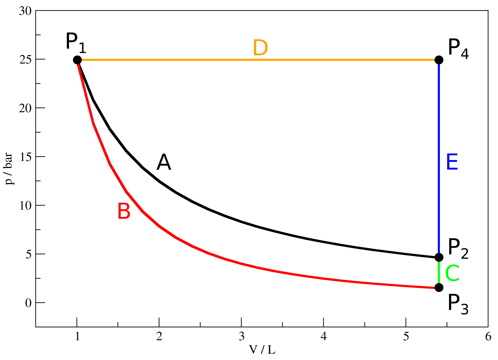

  A 1ᵃ. Lei da Termodinâmica (<a href="../A7/#TC7.5" style="color: blue; font-style: italic;">TC7.5</a>) garante que a energia não pode ser nem criada e nem destruída. Contudo, ela não é capaz de predizer se processos devem ocorrer <b>espontaneamente</b>, ou seja, sem que haja interferência exterior. Para isso, será necessário criarmos uma nova variável que será, também, uma função de estado.

## Calor reversível também não é função de estado

  Vamos considerar as seguintes transformações de um gás ideal descritas abaixo, que podem ser visualizadas na Figura 1:

  1) Caminho A, composto por uma expansão isotérmica reversível de P1 até P2;

  2) Caminho B+C, composto por (B) uma expansão adiabática reversível de P1 até P3 e, (C) um aquecimento isovolumétrico reversível de P3 até P2;

  3) Caminho D+E, composto por (D) um aquecimento isobárico reversível de P1 até P4 e, (E) um resfriamento isovolumétrico reversível de P4 até P2.

  E os pontos no plano $pV$ são dados por:  
  P1 = (p1, V1, T1);  
  P2 = (p2, V2, T1);  
  P3 = (p1, V2, T2);  
  P4 = (p4, V2, T3).  

<b>Figura 1.</b> Curvas no plano $pV$ para a transformação de um gás ideal do ponto P1 até o ponto P2 por caminhos diferentes.

  A Figura 1 mostra três caminhos diferentes para a transformação referida. Como os pontos inicial e final possuem a mesma temperatura, e sendo o gás é ideal, então $\boldsymbol{\Delta U_A = \Delta U_{B+C} = \Delta U_{D+E} = 0}$, uma vez que a energia interna é função de caminho e depende apenas da temperatura para um G.I., como visto na equação <a href="../A7/#TC7.11" style="color: blue; font-style: italic;">TC7.11c</a>. Mas, sendo todos os caminhos reversíveis, seus calores serão diferentes mesmo assim? A resposta para essa pergunta é <b>sim</b> e podemos calcular o calor de cada caminho através de:

  Caminho A: $q_{rev,A} = -w_{rev,A} = nRT ln \left( \frac{V_2}{V_1} \right)$  
  Caminho B+C: $q_{rev,B+C} = $q_{rev,B} + $q_{rev,C} = 0 + \int_{T_2}^{T_1} C_V \cdot \frac{dT}{T} = \int_{T_2}^{T_1} C_V \cdot \frac{dT}{T}$  
  Caminho D+E: $q_{rev,D+E} = $q_{rev,D} + $q_{rev,E} = \Delta U_D - w_{rev,D} + \int_{T_3}^{T_1} C_V \cdot \frac{dT}{T} = \int_{T_1}^{T_3} C_V \cdot \frac{dT}{T} + p_1 \cdot (V_2 - V_1) + \int_{T_3}^{T_1} C_V \cdot \frac{dT}{T} = p_1 \cdot (V_2 - V_1)$  

  Assim, fica claro que mesmo o calor reversível não é uma função de estado. No entanto, estamos prestes a criar uma nova função de estado a partir dela.

  

    $$\color{blue}{\boldsymbol{\left( \frac{\partial p}{\partial \bar V} \right)_{T_C} = 0 \quad ; \quad \left( \frac{\partial^2 p}{\partial \bar V^2} \right)_{T_C} = 0}}$$
  

  

    TC4.2
  

