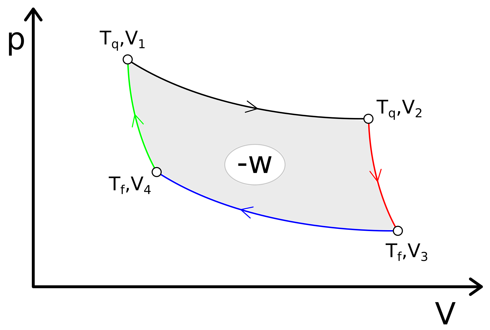
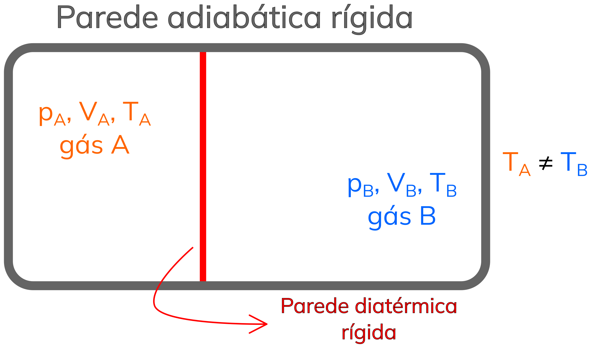

## O diferencial total da energia interna

  Finalmente, poderemos conectar a 1ᵃ. Lei da Termodinâmica, equação <a href="../A7/#TC7.5" style="color: blue; font-style: italic;">TC7.5</a>, na sua forma diferencial, com a 2ᵃ. Lei da Termodinâmica, equação <a href="../A8/#TC8.5" style="color: blue; font-style: italic;">TC8.5</a>, e escrever o <b>diferencial total</b> de U em função de suas <b>variáveis naturais</b>, $S$ e $V$:

  

    $$ dU = đq + đw \\
    dU = đq_{rev} + đw_{rev} \\
    \color{blue}{\boldsymbol{dU = T \cdot dS - p \cdot dV}}$$
  

  
    
    TC9.1
  

e, aqui, utilizamos o fato de U ser uma função de estado e escolhemos um caminho apropriado para definir seu diferencial total. A equação <a href="#TC9.1" style="color: blue; font-style: italic;">TC9.1</a> deixa claro que a energia interna é função das variáveis $S$ e $V$, ou seja $U=U(S,V)$. Do ponto de vista matemático, podemos escrever, então:

$dU = \left( \frac{\partial U}{\partial S} \right)_V dS + \left( \frac{\partial U}{\partial V} \right)_S dV$

Daí, por semelhança com a Equação <a href="#TC9.1" style="color: blue; font-style: italic;">TC9.1</a>, temos que:

$T = \left( \frac{\partial U}{\partial S} \right)_V \ e \ p = -\left( \frac{\partial U}{\partial V} \right)_S$

  Então, podemos escrever as duas derivadas parciais segundas cruzadas na forma:

$\left( \frac{\partial^2 U}{\partial S \partial V} \right) = -\left( \frac{\partial p}{\partial S} \right)_V$  
$\left( \frac{\partial^2 U}{\partial V \partial S} \right) = \left( \frac{\partial T}{\partial V} \right)_S$

  Para que U seja uma função convexa para ambas variáveis, é necessário que duas condições sejam satisfeitas, já que U é uma função de estado - suas derivadas cruzadas são iguais. Escrevendo a matriz hessiana de U, definida como:

$\begin{bmatrix}
  a & b\\
  c & d
\end{bmatrix}$

## Calor reversível também não é função de estado

  Vamos considerar as seguintes transformações de um gás ideal descritas abaixo, que podem ser visualizadas na Figura 1:

<b>1.</b> Caminho A, composto por uma expansão isotérmica reversível de P1 até P2;

<b>2.</b> Caminho B+C, composto por (B) uma expansão adiabática reversível de P1 até P3 e, (C) um aquecimento isovolumétrico reversível de P3 até P2;

<b>3.</b> Caminho D+E, composto por (D) um aquecimento isobárico reversível de P1 até P4 e, (E) um resfriamento isovolumétrico reversível de P4 até P2.

  E os pontos no plano $pV$ são dados por:  
  
  P1 = (p1, V1, T1);  
  P2 = (p2, V2, T1);  
  P3 = (p3, V2, T2);  
  P4 = (p1, V2, T3).  

<b>Figura 1.</b> Curvas no plano $pV$ para a transformação de um gás ideal do ponto P1 até o ponto P2 por caminhos diferentes.

  A Figura 1 mostra três caminhos diferentes para a transformação referida. Como os pontos inicial e final possuem a mesma temperatura, e sendo o gás é ideal, então $\boldsymbol{\Delta U_A = \Delta U_{B+C} = \Delta U_{D+E} = 0}$, uma vez que a energia interna é função de caminho e depende apenas da temperatura para um G.I., como visto na equação <a href="../A7/#TC7.11" style="color: blue; font-style: italic;">TC7.11c</a>. Mas, sendo todos os caminhos reversíveis, seus calores serão diferentes mesmo assim? A resposta para essa pergunta é <b>sim</b> e podemos calcular o calor de cada caminho através de:

  Caminho A:  $q_{rev,A} = -w_{rev,A} = nRT ln \left( \frac{V_2}{V_1} \right)$  
  Caminho B+C:  $q_{rev,B+C} = q_{rev,B} + q_{rev,C} = 0 + \int_{T_2}^{T_1} C_V \cdot dT = \int_{T_2}^{T_1} C_V \cdot dT$  
  Caminho D+E:  $q_{rev,D+E} = q_{rev,D} + q_{rev,E} = \Delta U_D - w_{rev,D} + \int_{T_3}^{T_1} C_V \cdot dT \\ = \int_{T_1}^{T_3} C_V \cdot dT + p_1 \cdot (V_2 - V_1) + \int_{T_3}^{T_1} C_V \cdot dT = p_1 \cdot (V_2 - V_1)$  

  Assim, fica claro que mesmo o calor reversível não é uma função de estado. No entanto, estamos prestes a criar uma nova função de estado a partir dela.

## A 2ª. Lei da Termodinâmica
### A máquina térmica de Sadi Carnot: a entropia

  Sadi Carnot foi um físico e engenheiro francês que trabalhou, sobretudo, nas teorias de envolvendo transferência de energia. Seu trabalho mais célebre se baseia em <i>máquinas térmicas</i>, isto é, máquinas capazes de converter calor em trabalho. Até hoje, seu trabalho é reconhecido como pioneiro na termodinâmica, graças ao seu rigor matemático. A partir de um ciclo de sua máquina térmica, o famoso "Ciclo de Carnot", podemos definir uma nova quantidade chamada de <b>entropia</b>, cujo símbolo moderno é <b>S</b>, em sua homenagem.

  A máquina térmica de Carnot utiliza transformações reversíveis de um G.I., e opera da seguinte forma:

<b>1.</b> Iniciando no ponto com $(T_q, V_1)$, realiza-se uma expansão isotérmica reversível até o ponto $(T_q, V_2)$, com processo de calor Qq;

<b>2.</b> Do ponto em $(T_q, V_2)$, realiza-se uma expansão adiabática reversível até o ponto em $(T_f, V_3)$;

<b>3.</b> Do ponto em $(T_f, V_3)$, realiza-se uma compressão isotérmica reversível até o ponto em $(T_f, V_4)$, com processo de calor Qf;

<b>4.</b> Do ponto em $(T_f, V_4)$, realiza-se uma compressão adiabática reversível até o ponto em $(T_q, V_4)$;

e o ciclo está representado na Figura 2, sendo a área cinza correspondente ao trabalho resultante extraído da máquina ($-w$).

<b>Figura 2.</b> Representação esquemática do ciclo de Carnot.

  Por ser um ciclo, temos que $\Delta U = 0$, o que significa que $w = -q $. Contudo, $q = Q_q + Q_f \neq 0$, pois calor não é uma função de estado, mesmo os calores sendo reversíveis. Vamos analisar a razão $\frac{Q_f}{Q_q}$. Como elas são calculáveis a partir do trabalho nos dois passos, teremos:

$\frac{Q_f}{Q_q} = \frac{nRT_f \cdot ln \left( {V_4}/{V_3}\right)}{nRT_q \cdot ln \left( {V_2}/{V_1}\right)} = \frac{T_f}{T_q} \cdot \frac{ln \left( {V_4}/{V_3}\right)}{ln \left( {V_2}/{V_1}\right)}$

  Entretanto, pelos passos adiabáticos, podemos escrever:

$\frac{T_q}{T_f} = \left( \frac{V_3}{V_2} \right)^{\bar C_V/R} = \left( \frac{V_4}{V_1} \right)^{\bar C_V/R}$  
$\frac{V_3}{V_4} = \frac{V_2}{V_1}$

  Quando essa última igualdade é utilizada na equação da razão dos calores, teremos:

  

    $$ \frac{Q_f}{Q_q} = -\frac{T_f}{T_q} \\
    \frac{Q_f}{T_f} + \frac{Q_q}{T_q} = 0 \\
    \color{red}{\boldsymbol{\sum_i \frac{Q_i}{T_i} = 0}} \\
    \color{blue}{\boldsymbol{dS_i \equiv \frac{đq_{rev,i}}{T_i}}}$$
  

  

    TC8.1a
    TC8.1b
  

ou seja, uma nova função de estado foi obtida para a máquina térmica de Carnot, pois a quantidade $\frac{q_{rev}}{T}$ se conserva ao longo do ciclo (<a href="#TC8.1" style="color: red; font-style: italic;">TC8.1a</a>)! Chamamos essa nova propriedade do sistema de <b>entropia, S</b>. Notemos, entretanto, que a entropia está relacionada ao calor <i>reversível</i>. Apesar do calor reversível não ser uma função de estado, a divisão do calor de cada passo pela temperatura do passo, no ciclo de Carnot, faz com que uma nova função de estado surja. Como para qualquer função de estado, seu cálculo pode ser realizado a partir de um caminho apropriado conectando o estado inicial de um sistema ao seu estado final, ao invés de utilizar o caminho realmente tomado - facilitando consideravelmente o seu cálculo.

### Enunciados clássicos da 2ª. Lei da Termodinâmica

  Essa formulação (de Carnot) para a definição de entropia e, consequentemente, da 2ᵃ. Lei da Termodinâmica, se baseia em máquinas térmicas. É possível enunciarmos a segunda lei nas seguintes formas (largamente utilizadas por cientistas, incluindo químicos):

  "Não existe máquina térmica cujo único efeito é extrair calor de uma fonte fria e passá-lo para a fonte quente."  
  "Não é possível construir um refrigerador ideal."  
  "Não é possível construir uma máquina térmica cujo rendimento seja de 100%."

dentre outras. Contudo, um estudante de química neste ponto deveria estar se perguntando: Se a máquina térmica for outra, a entropia ainda se conserva? O que uma máquina térmica tem a ver com reações químicas?

  A resposta para a primeira pergunta do estudante atento é: sim, a entropia é conservada para todas as máquinas. Clausius demonstrou isso e enunciou a entropia como função de estado de forma genérica, para máquinas térmicas:

  

    $$ \color{blue}{\boldsymbol{\oint \frac{đq_{rev}}{T} = \oint dS \ge 0}}$$
  

  

    TC8.2
  

conhecida como desigualdade de Clausius.

  Já a resposta para segunda pergunta é: <b>nada</b>. Máquinas térmicas foram largamente utilizadas por diversos motivos históricos e elas não possuem conexão direta com reações químicas - objeto de estudo de grande parte dos químicos. Sendo assim, por qual motivo ainda utilizamos a entropia do ciclo de Carnot em química?

## A formulação axiomática da entropia por Carathéodory

  No início do século XX, o físico Max Born (um dos nomes principais da mecânica quântica), se fez a mesma pergunta. A idéia de trabalhar com máquinas térmicas abstratas não lhe agradou e ele pediu a um amigo matemático, Constantin Carathéodory, para trabalhar no problema. Ao invés de máquinas térmicas, Carathéodory utilizou uma abordagem axiomática da entropia baseada nas equações de Pfaff - equações diferenciais conhecidas há tempos. Carathéodory demonstrou que o diferencial do calor reversivel, que é um diferencial <b>inexato</b> por ser uma função de caminho, possui um <b>fator de integração</b> quando $đq_{rev}=0$. Um fator de integração é um termo que transforma um diferencial inexato em exato:

  

    $$ \color{blue}{\boldsymbol{dS = \lambda(T) \cdot đq_{rev}}}$$
  

  

    TC8.3
  

  A equação <a href="#TC8.3" style="color: blue; font-style: italic;">TC8.3</a> define que a entropia será o diferencial do calor reversível multiplicado por um fator de integração, que Carathéodory definiu como sendo uma função de T, apenas. É possível demonstrar que essa função será: $\lambda(T) = \frac{c}{T}$, sendo $c$ uma constante a ser definida. Daí, é possível definir o diferencial da entropia como:

  

    $$ \color{blue}{\boldsymbol{dS = c \cdot \frac{đq_{rev}}{T}}}$$
  

  

    TC8.4
  

e reparem que a formulação acima é a mesma obtida a partir do ciclo de Carnot se $c = 1$ - ainda definiremos $c$. Como a equação <a href="#TC8.4" style="color: blue; font-style: italic;">TC8.4</a> foi definida a partir de $đq_{rev} = 0$, o teorema de Carathéodory nos diz que só há um caminho a partir de um ponto inicial P em equilíbrio, que possuem a mesma entropia que o ponto inicial, um caminho adiabático. Logo, é possível enunciarmos a 2ᵃ. Lei da Termodinâmica da seguinte forma:

  "Nas vizinhanças de um ponto inicial P, em equilíbrio, existem incontáveis pontos vizinhos que não podem ser acessados a partir de P por caminhos adiabáticos."

  Diferentemente das formulações anteriores, o enunciado da 2ᵃ. Lei da Termodinâmica pelo teorema de Carathéodory surge a partir de uma análise rigorosa de equações diferenciais e estados de equilíbrio de sistemas e processos adiabáticos - mas nenhuma máquina térmica ideal foi utilizada no processo. Agora, basta definirmos um valor para a constante $c$ que faça sentido físico e uma equação para a entropia com significado físico abrangente será obtida.

### Juntando teoria e experimento: o valor de $c$

  Vamos considerar dois sistemas, inicialmente nos estados $p_A, V_A, T_A$ e $p_B, V_B, T_B$, separadamente em equilíbrio cada um. Imaginemos, agora, que traremos os dois ao contato através de paredes diatérmicas rígidas e isolaremos ambos da vizinhança, como na Figura 2. Pela Lei Zero da Termodinâmica, o equilíbrio térmico será atingido em uma temperatura $T$, tal que $T$ seja um valor intermediário entre $T_A$ e $T_B$.

<b>Figura 3.</b> Sistema formado por 2 subsistemas, separados por parede rígida e diatérmica.

  Devido ao fato do sistema ser isolado do resto do universo, toda a energia interna dele será a soma das energias internas dos subsistemas A e B, e todo e qualquer processo de calor que ocorra irá modificar o valor de $U_A$ e $U_B$, mas a energia interna total será a mesma. Assim, podemos dizer que $dU_B = - dU_A$. Além disso, como não há trabalho de expansão/compressão, então $dU_i = đq_{rev,i}$.

  O próximo passo será considerar a entropia uma propriedade extensiva. Logo, ela também é aditiva e podemos dizer que a variaçãod entropia total será a soma das variações de entropia dos subsistemas A e B. Logo, $dS = dS_A + dS_B = c \cdot \frac{đq_{rev,A}}{T_A} + c \cdot \frac{đq_{rev,B}}{T_B}$. Como as variações de energia interna dos dois subsistemas não são independentes, podemos reescrever essa equação na forma:

   $dS = c \cdot dU_A \cdot \left(\frac{1}{T_A} - \frac{1}{T_B} \right)$

  Vamos analisar essa última expressão para ajustarmos o valor da constante $c$. Para o caso em que $T_A \gt T_B$, sabemos que haverá calor entre A e B, havendo transferência de energia de A para B. Logo, $dU_A \lt 0$. Da primeira desigualdade, também temos que $\frac{1}{T_A} - \frac{1}{T_B} \lt 0$. Assim, esses dois termos da equação para a entropia serão negativos. Caso façamos $c = 1$, então $dS \gt 0$ para um processo espontâneo. Caso tenhamos $T_A \lt T_B$, então ambos termos serão positivos e, com $c = 1$, novamente, teremos $dS \gt 0$ para um processo espontâneo, novamente. Ressaltamos que, neste caso, a entropia de Carathéodory será idêntica à entropia de Carnot e conciliaremos a entropia histórica com uma nova entropia com significado físico geral. Então, com $c=1$, a equação <a href="#TC8.4" style="color: blue; font-style: italic;">TC8.4</a> será:

  

    $$ \color{blue}{\boldsymbol{dS \equiv \frac{đq_{rev}}{T}}}$$
  

  

    TC8.5
  

  Daqui extraímos também uma resultado fundamental da Termodinâmica: a entropia pode ser utilizada como critério para espontaneidade de transformações! Entretanto, pelo nosso exemplo, ela será o único critério de espontaneidade necessário, caso o sistema seja isolado. O problema é que nem todo o sistema de interesse é isolado, mas está em contato com uma vizinhança, podendo haver calor e trabalho entre os dois. Neste caso, como definir um critério de espontaneidade mais amplo? A resposta para esta pergunta está na energia interna. Veremos que é possível transformar a energia interna em outras energias, que servem para outros propósitos.

